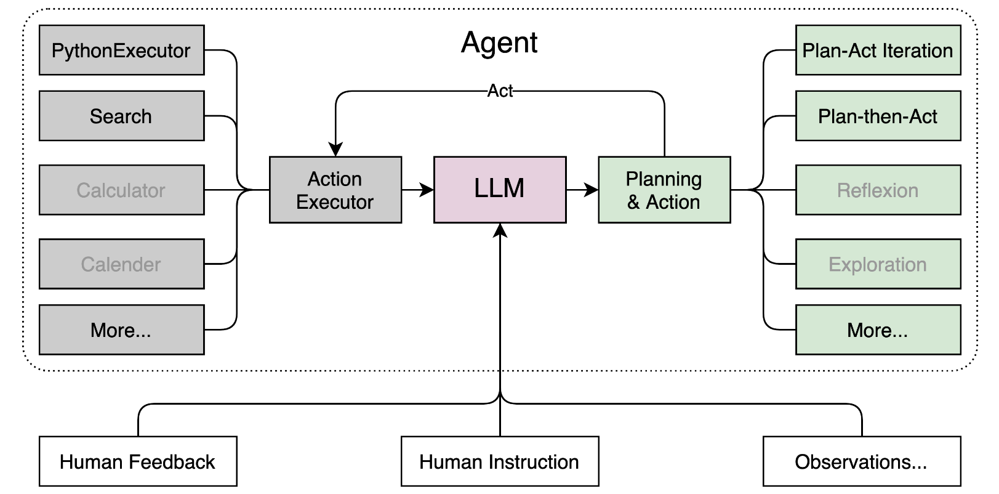

# 课时二 轻松分钟玩转书生·浦语大模型趣味 Demo


[飞书地址](https://aicarrier.feishu.cn/wiki/Vv4swUFMni5DiMkcasUczUp9nid#LSBkd2cTHorhsAx5jZAcO0B3nqe)


## 1. 提交的作业结果

[作业要求](https://github.com/InternLM/Tutorial/blob/camp2/helloworld/homework.md)

### 1.1 作业1
- 使用 InternLM2-Chat-1.8B 模型生成 300 字的小故事（截图）

  

### 1.2 作业2
- 熟悉 huggingface 下载功能，使用 huggingface_hub python 包，下载 InternLM2-Chat-7B 的 config.json 文件到本地（截图下载过程）

  

### 1.3 作业3

- 完成 Lagent 工具调用 数据分析 Demo 部署（截图）

  - 观察模型加载进度

    
  - 勾选数据分析

    

### 1.4 作业4

- 完成 浦语·灵笔2 的 图文创作 及 视觉问答 部署（截图）

### 1.5 业笔记

#### 1.5.1 模型生成小故事

#### 1.5.2 huggingface下载模型

- [模型地址](https://huggingface.co/internlm/internlm2-chat-1_8b)

- [huggingface hub python文档](https://huggingface.co/docs/huggingface_hub/quick-start)

进入demo环境（conda），输入python进入python命令编写如下代码进行模型config下载

``` python linenums="1"
from huggingface_hub import hf_hub_download
hf_hub_download(repo_id="internlm/internlm2-chat-1_8b", filename="config.json")
```


#### 1.5.3 Lagent 智能体

#### 1.5.4 灵笔2部署

- 图文创作

- 视觉问答


## 2. 视频笔记

[视频链接](https://www.bilibili.com/video/BV1AH4y1H78d/)

## 3. 文档复现笔记

[文档链接](https://github.com/InternLM/Tutorial/blob/camp2/helloworld/hello_world.md)

### 3.1 部署InternLM2-Chat-1.8B 模型进行智能对话

#### 3.1.1 配置基础环境

- 创建开发机

  进入[算力平台](https://studio.intern-ai.org.cn/)点击创建开发机，选择算力——>开发机命名——>选择镜像（cuda11.7-conda）——>设置算力用时。

  


- 配置开发机开发环境
  
  进入开发机终端，输入如下命令安装conda开发环境（实测运行12分钟左右）
  
  ``` bash
  studio-conda -o internlm-base -t demo
  # 与 studio-conda 等效的配置方案
  # conda create -n demo python==3.10 -y
  # conda activate demo
  # conda install pytorch==2.0.1 torchvision==0.15.2 torchaudio==2.0.2 pytorch-cuda=11.7 -c pytorch -c nvidia
  ```
  

  - conda create -n demo python==3.10 -y: 这个命令使用conda包管理器创建一个名为"demo"的环境，并指定使用Python 3.10版本。-y选项表示在创建环境时自动确认所有提示，无需手动确认。

  - conda activate demo: 这个命令用于激活名为"demo"的环境。激活环境后，所有后续的命令和操作都将在该环境中进行。

  - conda install pytorch==2.0.1 torchvision==0.15.2 torchaudio==2.0.2 pytorch-cuda=11.7 -c pytorch -c nvidia: 这个命令使用conda安装特定版本的PyTorch及其相关库。pytorch==2.0.1表示安装PyTorch 2.0.1版本，torchvision==0.15.2表示安装torchvision库的0.15.2版本，torchaudio==2.0.2表示安装torchaudio库的2.0.2版本。pytorch-cuda=11.7表示安装支持CUDA 11.7的PyTorch版本。-c pytorch -c nvidia指定了从pytorch和nvidia这两个渠道进行安装。

  
  
  

  查看conda环境list

  

  进入开发环境
  ``` bash
    conda activate demo
  ```

  

  进行环境依赖包安装

  ``` bash
   pip install huggingface-hub==0.17.3
   pip install transformers==4.34 
   pip install psutil==5.9.8
   pip install accelerate==0.24.1
   pip install streamlit==1.32.2 
   pip install matplotlib==3.8.3 
   pip install modelscope==1.9.5
   pip install sentencepiece==0.1.99
  ```

    - huggingface-hub: 提供了与Hugging Face模型和数据集库的交互功能。

    - transformers: 提供了用于自然语言处理任务的预训练模型和相关工具。

    - psutil: 提供了一个跨平台的库，用于获取系统信息和进程管理。

    - accelerate: 提供了用于加速深度学习训练的工具和API。

    - streamlit: 提供了一个用于构建交互式Web应用程序的Python库。

    - matplotlib: 提供了一个用于绘制图表和可视化数据的Python库。

    - modelscope: 提供了一个用于分析和比较机器学习模型的Python库。

    - sentencepiece: 提供了一个用于分词和生成子词单元的工具和库。

#### 3.1.2 下载大模型

  进入jupyter终端，进入demo环境（conda），cd到当前jupyter路径下。

``` bash
  cd /root
  conda activate demo
```


  创建文件夹&python文件

  ``` bash
   mkdir demo
   cd demo
   tourch cli_demo.py
   tourch download_mini.py
  ```

  

  编写脚本——download_mini.py

  ``` python linenums="1"
  import os  # 导入os模块，用于操作系统相关的操作
  from modelscope.hub.snapshot_download import snapshot_download  # 从modelscope.hub模块导入snapshot_download函数，用于下载模型

  # 创建保存模型目录
  os.system("mkdir /root/models")  # 使用os.system执行命令行命令，创建一个名为models的目录在/root路径下

  # save_dir是模型保存到本地的目录
  save_dir="/root/models"  # 定义变量save_dir，其值为模型保存的目录路径

  # 使用snapshot_download函数下载模型，参数包括模型的名字，缓存目录和版本号
  snapshot_download("Shanghai_AI_Laboratory/internlm2-chat-1_8b", 
                    cache_dir=save_dir, 
                    revision='v1.1.0')
  ```

  执行命令下载模型

  ``` bash
    python download_mini.py
  ```
  

  

  #### 3.1.3 基于大模型对话

    编写cli_demo.py脚本
  
  ```python  linenums="1"
        import torch  # 导入torch库，用于进行深度学习模型的操作
        from transformers import AutoTokenizer, AutoModelForCausalLM  # 从transformers库中导入AutoTokenizer和AutoModelForCausalLM，用于处理自然语言和加载模型

        model_name_or_path = "/root/models/Shanghai_AI_Laboratory/internlm2-chat-1_8b"  # 模型的名称或路径

        tokenizer = AutoTokenizer.from_pretrained(model_name_or_path, trust_remote_code=True, device_map='cuda:0')  # 加载预训练的tokenizer
        model = AutoModelForCausalLM.from_pretrained(model_name_or_path, trust_remote_code=True, torch_dtype=torch.bfloat16, device_map='cuda:0')  # 加载预训练的模型
        model = model.eval()  # 将模型设置为评估模式

        system_prompt = """You are an AI assistant whose name is InternLM (书生·浦语).
        - InternLM (书生·浦语) is a conversational language model that is developed by Shanghai AI Laboratory (上海人工智能实验室). It is designed to be helpful, honest, and harmless.
        - InternLM (书生·浦语) can understand and communicate fluently in the language chosen by the user such as English and 中文.
        """  # 系统提示信息

        messages = [(system_prompt, '')]  # 初始化消息列表

        print("=============Welcome to InternLM chatbot, type 'exit' to exit.=============")  # 打印欢迎信息

        while True:  # 循环接收用户输入
          input_text = input("\nUser  >>> ")  # 获取用户输入
          input_text = input_text.replace(' ', '')  # 去除用户输入的空格
          if input_text == "exit":  # 如果用户输入'exit'，则退出循环
            break

          length = 0
          for response, _ in model.stream_chat(tokenizer, input_text, messages):  # 使用模型进行聊天
            if response is not None:  # 如果响应不为空
              print(response[length:], flush=True, end="")  # 打印响应
              length = len(response)  # 更新响应长度
  ```

  

  输入提示词：创作一个300字的寓言故事，要求有趣
  

### 3.2 部署八戒-Chat-1.8B模型

#### 3.2.1 进入环境&下载源码

``` bash linenums="1"
conda activate demo
cd /root/
git clone https://gitee.com/InternLM/Tutorial -b camp2
# git clone https://github.com/InternLM/Tutorial -b camp2
cd /root/Tutorial
```


#### 3.2.2 运行Chat-八戒

- bajie_download.py

``` python linenums="1"
import os
#模型下载
from modelscope.hub.snapshot_download import snapshot_download

# 创建保存模型目录
os.system("mkdir -p /root/models")

# save_dir是模型保存到本地的目录
save_dir="/root/models"

snapshot_download('JimmyMa99/BaJie-Chat-mini', 
                  cache_dir=save_dir)
```

- 运行模型下载代码
``` bash
python /root/Tutorial/helloworld/bajie_download.py
```


- 运行启动streamlit前端页面

``` bash
streamlit run /root/Tutorial/helloworld/bajie_chat.py --server.address 127.0.0.1 --server.port 6006
```


- 本地端口映射

点击SSH连接，找寻自己的端口号，并对应修改ssh映射命令的端口号

``` bash
# 从本地使用 ssh 连接 studio 端口
# 将下方端口号 38374 替换成自己的端口号
ssh -CNg -L 6006:127.0.0.1:6006 root@ssh.intern-ai.org.cn -p 38374
```

``` markdown
ssh: 这是SSH客户端命令，用于建立安全的远程连接。

-CNg: 这是ssh命令的选项。-C选项启用压缩，-N选项指示ssh不要执行远程命令，-g选项允许远程主机通过隧道连接到本地主机。

-L 6006:127.0.0.1:6006: 这是ssh命令的端口转发选项。它指示ssh在本地主机的端口6006上监听，并将所有传入的连接转发到远程主机的127.0.0.1:6006。

root@ssh.intern-ai.org.cn: 这是远程主机的用户名和主机名。在这个例子中，用户名是root，主机名是ssh.intern-ai.org.cn。

-p 38374: 这是ssh命令的端口选项。它指示ssh使用38374端口连接到远程主机。
```


  - 模型加载中
  
  - 加载完成界面
  
  - 对话
  

### 3.3 Lagent 智能体

#### 3.3.1 前置知识
  
  Lagent 是一个轻量级、开源的基于大语言模型的智能体（agent）框架，支持用户快速地将一个大语言模型转变为多种类型的智能体，并提供了一些典型工具为大语言模型赋能。它的整个框架图如下:
  
  

#### 3.3.2 实现过程
  
##### 3.3.2.1 开发机设置

- 开启 30% A100
   
   创建开发机命名为LagentPro，镜像选择Cuda11.7，资源配置现存20G，内存72G


- 进入开发机，进入demo环境

```bash
conda activate demo
```


- 下载Lagent源码

``` bash
cd /root/demo
git clone https://gitee.com/internlm/lagent.git
# git clone https://github.com/internlm/lagent.git
cd /root/demo/lagent
git checkout 581d9fb8987a5d9b72bb9ebd37a95efd47d479ac
pip install -e . # 源码安装
```


##### 3.3.2.2 使用Lagent运行InternLM2大模型的智能体

- 构造软链接快捷访问方式

```bash
ln -s /root/share/new_models/Shanghai_AI_Laboratory/internlm2-chat-7b /root/models/internlm2-chat-7b
```
- 修改lagent路径下 examples/internlm2_agent_web_demo_hf.py 脚本模型加载路径

```python 
model_path = st.sidebar.text_input('模型路径：', value='/root/models/internlm2-chat-7b')
```


- 运行streamlit前端页面

```bash
streamlit run /root/demo/lagent/examples/internlm2_agent_web_demo_hf.py --server.address 127.0.0.1 --server.port 6006
```


- 本地ssh连接设置

```bash
ssh -CNg -L 6006:127.0.0.1:6006 root@ssh.intern-ai.org.cn -p 41227
```


- 本地运行streamlit 前端页面

http://127.0.0.1:6006/

  - 注意：观察模型加载进度
  
  - 注意勾选数据分析（可观测Agent智能体的调用过程——调用了什么方法组合进行解题）
  

- 让智能体告诉我他的能力并测验能力

  Q:你作为Agent智能体，能给我一个示例能体现你能力吗？
  A:


#### 3.3.3 源码解析

``` python linenums="1"
import copy
import hashlib
import json
import os

import streamlit as st

from lagent.actions import ActionExecutor, ArxivSearch, IPythonInterpreter
from lagent.agents.internlm2_agent import INTERPRETER_CN, META_CN, PLUGIN_CN, Internlm2Agent, Internlm2Protocol
from lagent.llms import HFTransformer
from lagent.llms.meta_template import INTERNLM2_META as META
from lagent.schema import AgentStatusCode

# 从streamlit.logger导入get_logger函数，但未使用


class SessionState:
    def init_state(self):
        """初始化会话状态变量."""
        # 在st.session_state中创建'assistant'和'user'列表，用于存储对话历史记录
        st.session_state['assistant'] = []
        st.session_state['user'] = []
        
        # 创建动作列表，包括ArxivSearch()
        action_list = [
            ArxivSearch(),
        ]
        # 在st.session_state中创建'plugin_map'字典，将动作名称映射到动作对象
        st.session_state['plugin_map'] = {
            action.name: action
            for action in action_list
        }
        # 在st.session_state中创建空的'model_map'字典，用于存储模型对象
        st.session_state['model_map'] = {}
        # 在st.session_state中创建'model_selected'变量，用于存储当前选择的模型名称
        st.session_state['model_selected'] = None
        # 在st.session_state中创建空的'plugin_actions'集合，用于存储当前选择的插件动作
        st.session_state['plugin_actions'] = set()
        # 在st.session_state中创建空的'history'列表，用于存储对话历史记录
        st.session_state['history'] = []

    def clear_state(self):
        """清除现有的会话状态."""
        # 清空'assistant'和'user'列表，以及'model_selected'变量和'file'集合
        st.session_state['assistant'] = []
        st.session_state['user'] = []
        st.session_state['model_selected'] = None
        st.session_state['file'] = set()
        # 如果'chatbot'存在于st.session_state中，则清空其会话历史记录
        if 'chatbot' in st.session_state:
            st.session_state['chatbot']._session_history = []


class StreamlitUI:
    def __init__(self, session_state: SessionState):
        # 初始化StreamlitUI对象，并设置其session_state属性为传入的SessionState对象
        self.init_streamlit()
        self.session_state = session_state

    def init_streamlit(self):
        """初始化Streamlit的UI设置."""
        # 设置页面配置，包括布局、页面标题和页面图标
        st.set_page_config(
            layout='wide',
            page_title='lagent-web',
            page_icon='./docs/imgs/lagent_icon.png')
        # 在页面上显示标题和分隔线
        st.header(':robot_face: :blue[Lagent] Web Demo ', divider='rainbow')
        # 在侧边栏上显示标题
        st.sidebar.title('模型控制')
        # 在st.session_state中创建空的'file'集合，用于存储上传的文件
        st.session_state['file'] = set()
        # 在st.session_state中创建'model_path'变量，用于存储模型路径
        st.session_state['model_path'] = None

    def setup_sidebar(self):
        """设置侧边栏，用于模型和插件选择."""
        # 从侧边栏获取模型名称输入，默认值为'internlm2-chat-7b'
        model_name = st.sidebar.text_input('模型名称：', value='internlm2-chat-7b')
        # 从侧边栏获取系统提示词输入，默认值为META_CN
        meta_prompt = st.sidebar.text_area('系统提示词', value=META_CN)
        # 从侧边栏获取数据分析提示词输入，默认值为INTERPRETER_CN
        da_prompt = st.sidebar.text_area('数据分析提示词', value=INTERPRETER_CN)
        # 从侧边栏获取插件提示词输入，默认值为PLUGIN_CN
        plugin_prompt = st.sidebar.text_area('插件提示词', value=PLUGIN_CN)
        # 从侧边栏获取模型路径输入，默认值为'/root/models/internlm2-chat-7b'
        model_path = st.sidebar.text_input(
            '模型路径：', value='/root/models/internlm2-chat-7b')
        
        # 检查模型名称或模型路径是否已更改，如果是，则初始化新模型并清除会话状态
        if model_name != st.session_state['model_selected'] or st.session_state['model_path'] != model_path:
            st.session_state['model_path'] = model_path
            model = self.init_model(model_name, model_path)
            self.session_state.clear_state()
            st.session_state['model_selected'] = model_name
            if 'chatbot' in st.session_state:
                del st.session_state['chatbot']
        else:
            # 如果模型未更改，则从st.session_state中的'model_map'字典获取现有模型对象
            model = st.session_state['model_map'][model_name]
        
        # 从侧边栏获取插件名称的多选输入，默认值为空列表
        plugin_name = st.sidebar.multiselect(
            '插件选择',
            options=list(st.session_state['plugin_map'].keys()),
            default=[],
        )
        # 从侧边栏获取数据分析的复选框输入，默认值为False
        da_flag = st.sidebar.checkbox(
            '数据分析',
            value=False,
        )
        # 从插件名称列表中获取插件动作列表
        plugin_action = [
            st.session_state['plugin_map'][name] for name in plugin_name
        ]
        
        # 如果'chatbot'存在于st.session_state中，则根据选择的插件和数据分析设置更新其属性
        if 'chatbot' in st.session_state:
            if len(plugin_action) > 0:
                # 如果选择了插件，则创建ActionExecutor对象并设置chatbot的_action_executor属性为该对象
                st.session_state['chatbot']._action_executor = ActionExecutor(actions=plugin_action)
            else:
                # 如果没有选择插件，则将chatbot的_action_executor属性设置为None
                st.session_state['chatbot']._action_executor = None
            if da_flag:
                # 如果选择了数据分析，则创建ActionExecutor对象并设置chatbot的_interpreter_executor属性为该对象
                st.session_state['chatbot']._interpreter_executor = ActionExecutor(actions=[IPythonInterpreter()])
            else:
                # 如果没有选择数据分析，则将chatbot的_interpreter_executor属性设置为None
                st.session_state['chatbot']._interpreter_executor = None
            # 更新chatbot的提示词属性为侧边栏输入的值
            st.session_state['chatbot']._protocol._meta_template = meta_prompt
            st.session_state['chatbot']._protocol.plugin_prompt = plugin_prompt
            st.session_state['chatbot']._protocol.interpreter_prompt = da_prompt
        if st.sidebar.button('清空对话', key='clear'):
            # 如果点击了侧边栏上的“清空对话”按钮，则调用SessionState对象的clear_state方法来清除会话状态
            self.session_state.clear_state()
        # 从侧边栏获取文件上传器输入，用于上传文件到应用程序中使用
        uploaded_file = st.sidebar.file_uploader('上传文件')
        return model_name, model, plugin_action, uploaded_file, model_path
    
    def init_model(self, model_name, path):
        """根据输入的模型名称初始化模型."""
        # 使用HFTransformer类初始化模型对象，并将模型路径和其他参数传递给构造函数。将模型对象存储在st.session_state中的'model_map'字典中。
        st.session_state['model_map'][model_name] = HFTransformer(path=path, meta_template=META, max_new_tokens=1024, top_p=0.8, top_k=None, temperature=0.1, repetition_penalty=1.0, stop_words=['<|im_end|>'])
        return st.session_state['model_map'][model_name]
    def initialize_chatbot(self, model, plugin_action):
    """使用给定的模型和插件动作初始化聊天机器人."""
    # 使用Internlm2Agent类初始化聊天机器人对象，并将LLM（语言模型）、协议和最大回合数传递给构造函数。返回聊天机器人对象。
    return Internlm2Agent(
        llm=model,
        protocol=Internlm2Protocol(
            tool=dict(
                begin='{start_token}{name}\n',
                start_token='<|action_start|>',
                name_map=dict(
                    plugin='<|plugin|>', interpreter='<|interpreter|>'),
                belong='assistant',
                end='<|action_end|>\n',
            ), ),
        max_turn=7)

def render_user(self, prompt: str):
    # 使用st.chat_message('user')在聊天窗口中创建一个新的用户消息，并使用st.markdown(prompt)显示提示文本。
    with st.chat_message('user'):
        st.markdown(prompt)

def render_assistant(self, agent_return):
    # 使用st.chat_message('assistant')在聊天窗口中创建一个新的助手消息，并迭代agent_return中的actions。对于每个不是FinishAction的非空动作，调用render_action方法来显示它。最后，使用st.markdown(agent_return.response)显示agent_return的响应。
    with st.chat_message('assistant'):
        for action in agent_return.actions:
            if (action) and (action.type != 'FinishAction'):
                self.render_action(action)
        st.markdown(agent_return.response)

def render_plugin_args(self, action):
    # 从动作中获取动作名称和参数，并将它们转换为JSON格式的字符串。使用st.markdown显示该字符串。
    action_name = action.type
    args = action.args
    import json
    parameter_dict = dict(name=action_name, parameters=args)
    parameter_str = '```json\n' + json.dumps(parameter_dict, indent=4, ensure_ascii=False) + '\n```'
    st.markdown(parameter_str)

def render_interpreter_args(self, action):
    # 使用st.info显示动作类型，并使用st.markdown显示动作参数中的文本。
    st.info(action.type)
    st.markdown(action.args['text'])

def render_action(self, action):
    # 使用st.markdown显示动作的thought属性。如果动作类型是IPythonInterpreter，则调用render_interpreter_args方法来显示参数。否则，如果动作类型不是FinishAction，则调用render_plugin_args方法来显示参数。最后，调用render_action_results方法来显示动作的结果。
    st.markdown(action.thought)
    if action.type == 'IPythonInterpreter':
        self.render_interpreter_args(action)
    elif action.type == 'FinishAction':
        pass
    else:
        self.render_plugin_args(action)
    self.render_action_results(action)

def render_action_results(self, action):
    """显示动作的结果，包括文本、图像、视频和音频."""
    # 如果动作结果是字典，则检查它是否包含文本、图像、视频或音频，并使用相应的st方法显示它们。如果结果是列表，则迭代每个项目，并根据其类型显示相应的内容。如果动作有错误消息，则使用st.error显示它。
    if (isinstance(action.result, dict)):
        if 'text' in action.result:
            st.markdown('```\n' + action.result['text'] + '\n```')
        if 'image' in action.result:
            # image_path = action.result['image']
            for image_path in action.result['image']:
                image_data = open(image_path, 'rb').read()
                st.image(image_data, caption='Generated Image')
        if 'video' in action.result:
            video_data = action.result['video']
            video_data = open(video_data, 'rb').read()
            st.video(video_data)
        if 'audio' in action.result:
            audio_data = action.result['audio']
            audio_data = open(audio_data, 'rb').read()
            st.audio(audio_data)
    elif isinstance(action.result, list):
        for item in action.result:
            if item['type'] == 'text':
                st.markdown('```\n' + item['content'] + '\n```')
            elif item['type'] == 'image':
                image_data = open(item['content'], 'rb').read()
                st.image(image_data, caption='Generated Image')
            elif item['type'] == 'video':
                video_data = open(item['content'], 'rb').read()
                st.video(video_data)
            elif item['type'] == 'audio':
                audio_data = open(item['content'], 'rb').read()
                st.audio(audio_data)
    if action.errmsg:
        st.error(action.errmsg)
def main():
    # 如果'ui'不在st.session_state中，则初始化SessionState对象和StreamlitUI对象，并将它们存储在st.session_state中。否则，设置页面配置并显示标题和分隔线。然后，调用StreamlitUI对象的setup_sidebar方法来设置侧边栏。接下来，检查'chatbot'是否存在于st.session_state中，或者模型是否已更改。如果是，则调用initialize_chatbot方法来初始化聊天机器人，并将会话历史记录设置为空列表。最后，迭代会话状态中的用户提示和代理返回，并调用相应的render方法来显示它们。由于代码片段不完整，无法提供完整的main函数注释。请注意，您可能需要提供缺少的代码和变量以使main函数正常工作。
    if 'ui' not in st.session_state:
        session_state = SessionState()
        session_state.init_state()
        st.session_state['ui'] = StreamlitUI(session_state)
    else:
        st.set_page_config(layout='wide', page_title='lagent-web', page_icon='./docs/imgs/lagent_icon.png')
        st.header(':robot_face: :blue[Lagent] Web Demo ', divider='rainbow')
    _, model, plugin_action, uploaded_file, _ = st.session_state['ui'].setup_sidebar()
    if 'chatbot' not in st.session_state or model != st.session_state['chatbot']._llm:
        st.session_state['chatbot'] = st.session_state['ui'].initialize_chatbot(model, plugin_action)
        st.session_state['session_history'] = []
    for prompt, agent_return in zip(st.session_state['user'], st.session_state['assistant']): # 假设这些变量存在于会话状态中并包含适当的值。您可能需要根据您的应用程序逻辑进行调整。
        st.session_state['ui'].render_user(prompt) # 显示用户提示。您可能需要根据您的应用程序逻辑进行调整。
        st.session_state['ui'].render_assistant(agent_return) # 显示代理返回。您可能需要根据您的应用程序逻辑进行调整
```