# 课时三 "茴香豆":零代码搭建你的 RAG 智能助理


[飞书地址](https://aicarrier.feishu.cn/wiki/Vv4swUFMni5DiMkcasUczUp9nid#LSBkd2cTHorhsAx5jZAcO0B3nqe)

 [算力平台](https://studio.intern-ai.org.cn/)

## 1. 提交的作业结果

[作业要求](https://github.com/InternLM/Tutorial/blob/camp2/huixiangdou/homework.md)

### 1.1 茴香豆web版部署知识问答助手

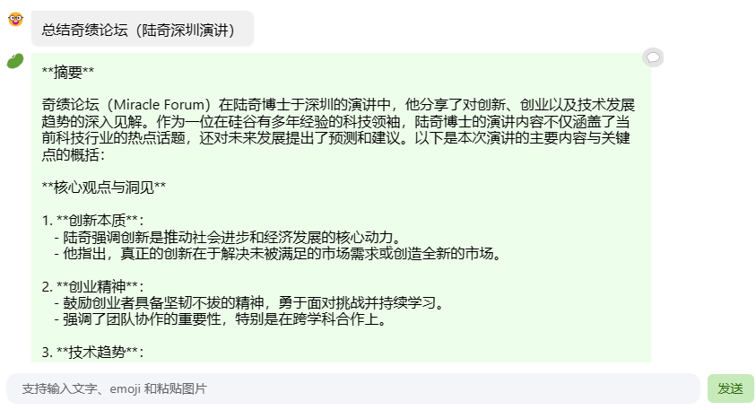

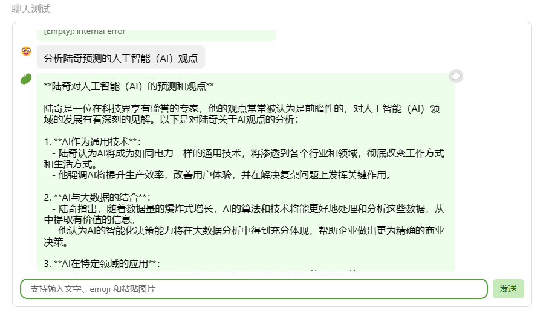

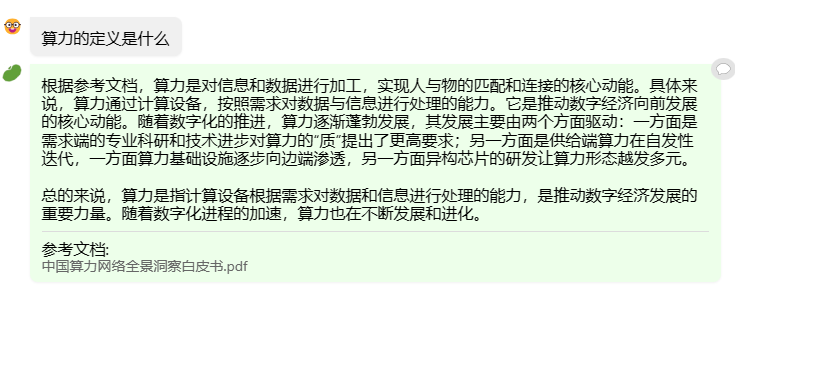

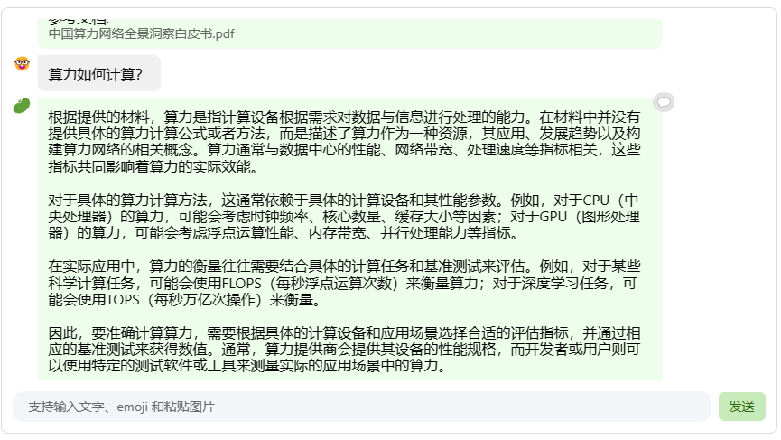

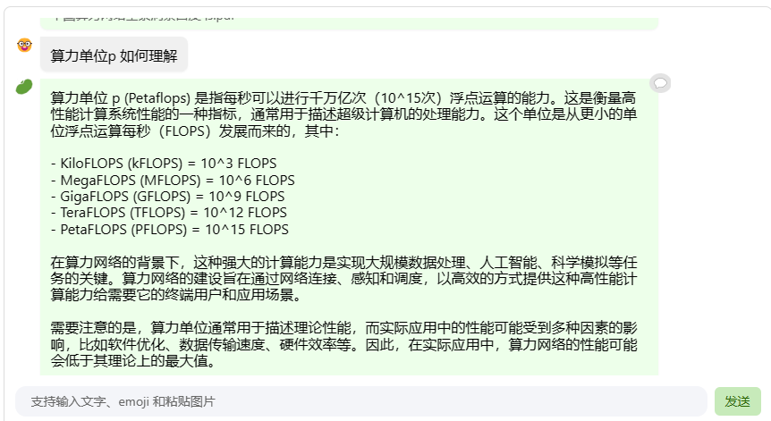

### 1.2 茴香豆技术助手

#### 1.2.1 代码版
  - Q1:huixiangdou 是什么？
    - A：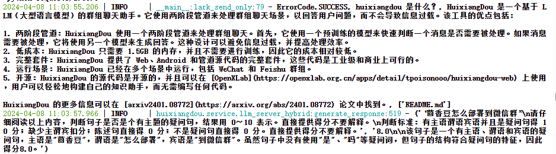

  - Q2:茴香豆怎么部署到微信群?
    - A: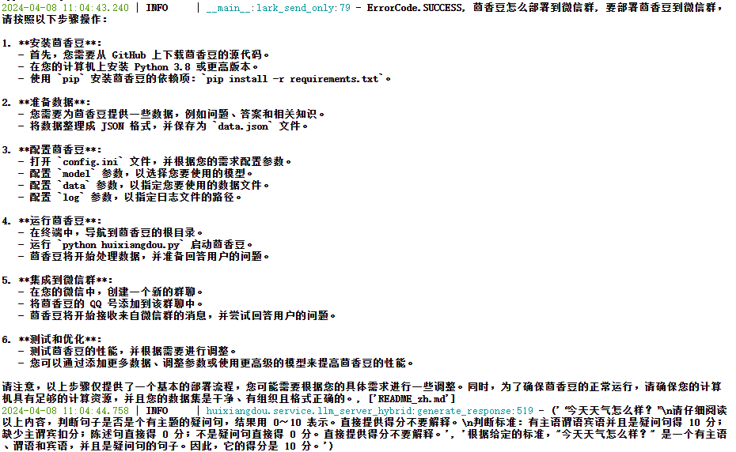

  - Q3:今天天气怎么样？
    - A:ErrorCode.UNRELATED
    

#### 1.2.2 giradio网页版

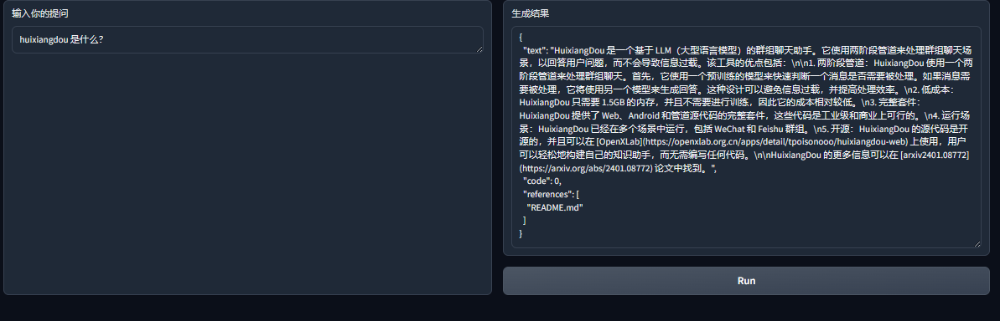

- 注意：提问需要带问号，不带问号识别不出是疑问句。。。
  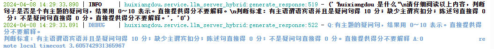
- code为3，不返回结果
  

### 1.3 进阶作业

#### A.【应用方向】 结合自己擅长的领域知识（游戏、法律、电子等）、专业背景，搭建个人工作助手或者垂直领域问答助手，参考茴香豆官方文档，部署到下列任一平台。
  - 飞书、微信
  - 可以使用 茴香豆 Web 版 或 InternLM Studio 云端服务器部署
  - 涵盖部署全过程的作业报告和个人助手问答截图

#### B.【算法方向】尝试修改 `good_questions.json`、调试 prompt 或应用其他 NLP 技术，如其他 chunk 方法，提高个人工作助手的表现。
  - 完成不少于 400 字的笔记 ，记录自己的尝试和调试思路，涵盖全过程和改进效果截图

### 1.4 大作业项目

#### A.【工程方向】 参与贡献茴香豆前端，将茴香豆助手部署到下列平台
  - Github issue、Discord、钉钉、X
#### B.【应用方向】 茴香豆RAG-Agent
  - 应用茴香豆建立一个 ROS2 的机器人Agent
#### C.【算法方向】 茴香豆多模态
  - 参与茴香豆多模态的工作

## 2. 视频笔记

[视频地址](https://www.bilibili.com/video/BV1QA4m1F7t4/)

## 3. 文档笔记

[文档地址](https://github.com/InternLM/Tutorial/blob/camp2/huixiangdou/readme.md)

### 3.1 前置知识

  RAG（Retrieval Augmented Generation）技术，通过检索与用户输入相关的信息片段，并结合***外部知识库***来生成更准确、更丰富的回答。解决 LLMs 在处理知识密集型任务时可能遇到的挑战, 如**幻觉、知识过时和缺乏透明、可追溯的推理过程**等。提供更准确的回答、降低推理成本、实现外部记忆。

  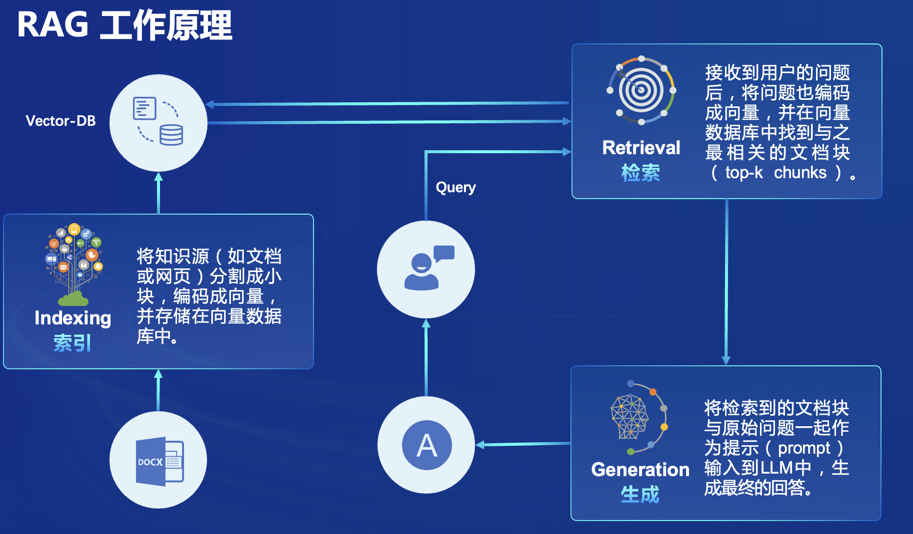

### 3.2 创建huixiangdou环境（conda）

```bash
studio-conda -o internlm-base -t InternLM2_Huixiangdou
```


- 进入huixiangdou环境

```bash
conda activate InternLM2_Huixiangdou
```


### 3.3 模型文件

#### 3.3.1 RAG模型
- Github地址
  
  - [BCEmbedding](https://github.com/netease-youdao/BCEmbedding/blob/master/README_zh.md)

| 模型名称              |      模型类型      | 支持语种 | 参数量 |                                                                           开源权重                                                                           |
| :-------------------- | :----------------: | :------: | :----: | :-----------------------------------------------------------------------------------------------------------------------------------------------------------: |
| bce-embedding-base_v1 | `EmbeddingModel` |   中英   |  279M  | [Huggingface(推荐)](https://huggingface.co/maidalun1020/bce-embedding-base_v1), [国内通道](https://hf-mirror.com/maidalun1020/bce-embedding-base_v1), [ModelScope](https://www.modelscope.cn/models/maidalun/bce-embedding-base_v1/summary), [WiseModel](https://wisemodel.cn/models/Netease_Youdao/bce-embedding-base_v1) |
| bce-reranker-base_v1  | `RerankerModel` | 中英日韩 |  279M  |  [Huggingface(推荐)](https://huggingface.co/maidalun1020/bce-reranker-base_v1), [国内通道](https://hf-mirror.com/maidalun1020/bce-reranker-base_v1), [ModelScope](https://www.modelscope.cn/models/maidalun/bce-reranker-base_v1/summary), [WiseModel](https://wisemodel.cn/models/Netease_Youdao/bce-reranker-base_v1) |

#### 3.3.2 share模型软链接

```bash
# 创建模型文件夹
cd /root && mkdir models

# 复制BCE模型
ln -s /root/share/new_models/maidalun1020/bce-embedding-base_v1 /root/models/bce-embedding-base_v1
ln -s /root/share/new_models/maidalun1020/bce-reranker-base_v1 /root/models/bce-reranker-base_v1

# 复制大模型参数（下面的模型，根据作业进度和任务进行**选择一个**就行）
ln -s /root/share/new_models/Shanghai_AI_Laboratory/internlm2-chat-7b /root/models/internlm2-chat-7b
```


### 3.4 下载安装茴香豆

#### 3.4.1 安装茴香豆依赖包

```bash
# 安装 python 依赖
# pip install -r requirements.txt

pip install protobuf==4.25.3 accelerate==0.28.0 aiohttp==3.9.3 auto-gptq==0.7.1 bcembedding==0.1.3 beautifulsoup4==4.8.2 einops==0.7.0 faiss-gpu==1.7.2 langchain==0.1.14 loguru==0.7.2 lxml_html_clean==0.1.0 openai==1.16.1 openpyxl==3.1.2 pandas==2.2.1 pydantic==2.6.4 pymupdf==1.24.1 python-docx==1.1.0 pytoml==0.1.21 readability-lxml==0.8.1 redis==5.0.3 requests==2.31.0 scikit-learn==1.4.1.post1 sentence_transformers==2.2.2 textract==1.6.5 tiktoken==0.6.0 transformers==4.39.3 transformers_stream_generator==0.0.5 unstructured==0.11.2

## 因为 Intern Studio 不支持对系统文件的永久修改，在 Intern Studio 安装部署的同学不建议安装 Word 依赖，后续的操作和作业不会涉及 Word 解析。
## 想要自己尝试解析 Word 文件的同学，uncomment 掉下面这行，安装解析 .doc .docx 必需的依赖
# apt update && apt -y install python-dev python libxml2-dev libxslt1-dev antiword unrtf poppler-utils pstotext tesseract-ocr flac ffmpeg lame libmad0 libsox-fmt-mp3 sox libjpeg-dev swig libpulse-dev
```


#### 3.4.2 获取茴香豆源码

```bash
cd /root
# 下载 repo
git clone https://github.com/internlm/huixiangdou && cd huixiangdou
git checkout 447c6f7e68a1657fce1c4f7c740ea1700bde0440
```


### 3.5 搭建RAG助手

#### 3.5.1 修改config.ini配置文件

  通过命令行修改三个模型路径：嵌入模型、重排模型、大语言模型：
- embedding_model_path（向量数据库和词嵌入的模型）
  ```bash
  sed -i '6s#.*#embedding_model_path = "/root/models/bce-embedding-base_v1"#' /root/huixiangdou/config.ini
  ```
  >这个命令是用来在指定文件中的特定行进行替换操作的。这个命令的不同部分：
    - sed：这是一个流编辑器，用于对文本进行处理和转换。
    - -i：这是sed命令的一个选项，表示直接在原始文件中进行修改，而不是将结果输出到标准输出。
    - '6s#.*#embedding_model_path = "/root/models/bce-embedding-base_v1"#'：这是sed命令的一个模式，用于指定要替换的行和替换的内容。在这个例子中，6表示要替换的行号，s表示替换操作，#是分隔符，.*表示匹配任意字符，embedding_model_path = "/root/models/bce-embedding-base_v1"是要替换的内容。
    - /root/huixiangdou/config.ini：这是要进行替换操作的文件的路径。
  这个命令的作用是将/root/huixiangdou/config.ini文件中的第6行替换为embedding_model_path = "/root/models/bce-embedding-base_v1"。
- reranker_model_path（检索的重排序模型）
  ```bash
  sed -i '7s#.*#reranker_model_path = "/root/models/bce-reranker-base_v1"#' /root/huixiangdou/config.ini
  ```
- local_llm_path（大语言模型）
  ```bash
  sed -i '29s#.*#local_llm_path = "/root/models/internlm2-chat-7b"#' /root/huixiangdou/config.ini
  ```
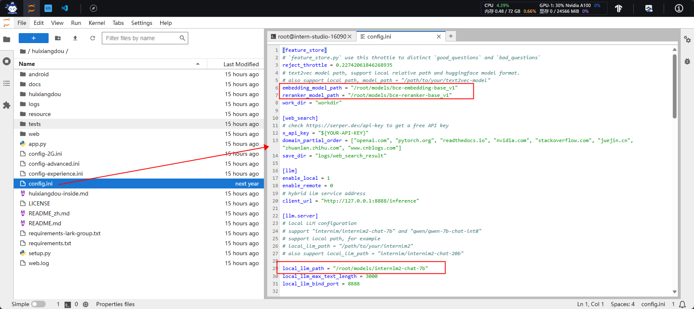

**注意：** 也可以直接打开config.ini文件进行文档编辑修改。

#### 3.5.2 创建知识库

  使用 InternLM 的 Huixiangdou 文档作为新增知识数据检索来源，在不重新训练的情况下，打造一个 Huixiangdou 技术问答助手。

##### 3.5.2.1 下载语料

   直接下载茴香豆源码到/root/huixiangdou/repodir下用作语料。

```bash
cd /root/huixiangdou && mkdir repodir

git clone https://github.com/internlm/huixiangdou --depth=1 repodir/huixiangdou
```
##### 3.5.2.2 接受&拒绝向量数据库

  除了语料知识的向量数据库，茴香豆建立接受和拒答两个向量数据库，用来在检索的过程中更加精确的判断提问的相关性，这两个数据库的来源分别是：
  - 接受问题列表，希望茴香豆助手回答的示例问题
    - 存储在 huixiangdou/resource/good_questions.json 中
  - 拒绝问题列表，希望茴香豆助手拒答的示例问题
    - 存储在 huixiangdou/resource/bad_questions.json 中
    - 其中多为技术无关的主题或闲聊。
    - 如："nihui 是谁", "具体在哪些位置进行修改？", "你是谁？", "1+1"

##### 3.5.2.3 增加茴香豆相关的问题到接受问题示例
  从/root/huixiangdou/resource/good_questions.json文件备份为/root/huixiangdou/resource/good_questions_bk.json文件；使用echo方法新增内容并创建/root/huixiangdou/resource/good_questions.json文件。

```bash
cd /root/huixiangdou
mv resource/good_questions.json resource/good_questions_bk.json

echo '[
    "mmpose中怎么调用mmyolo接口",
    "mmpose实现姿态估计后怎么实现行为识别",
    "mmpose执行提取关键点命令不是分为两步吗，一步是目标检测，另一步是关键点提取，我现在目标检测这部分的代码是demo/topdown_demo_with_mmdet.py demo/mmdetection_cfg/faster_rcnn_r50_fpn_coco.py checkpoints/faster_rcnn_r50_fpn_1x_coco_20200130-047c8118.pth   现在我想把这个mmdet的checkpoints换位yolo的，那么应该怎么操作",
    "在mmdetection中，如何同时加载两个数据集，两个dataloader",
    "如何将mmdetection2.28.2的retinanet配置文件改为单尺度的呢？",
    "1.MMPose_Tutorial.ipynb、inferencer_demo.py、image_demo.py、bottomup_demo.py、body3d_pose_lifter_demo.py这几个文件和topdown_demo_with_mmdet.py的区别是什么，\n2.我如果要使用mmdet是不是就只能使用topdown_demo_with_mmdet.py文件，",
    "mmpose 测试 map 一直是 0 怎么办？",
    "如何使用mmpose检测人体关键点？",
    "我使用的数据集是labelme标注的，我想知道mmpose的数据集都是什么样式的，全都是单目标的数据集标注，还是里边也有多目标然后进行标注",
    "如何生成openmmpose的c++推理脚本",
    "mmpose",
    "mmpose的目标检测阶段调用的模型，一定要是demo文件夹下的文件吗，有没有其他路径下的文件",
    "mmpose可以实现行为识别吗，如果要实现的话应该怎么做",
    "我在mmyolo的v0.6.0 (15/8/2023)更新日志里看到了他新增了支持基于 MMPose 的 YOLOX-Pose，我现在是不是只需要在mmpose/project/yolox-Pose内做出一些设置就可以，换掉demo/mmdetection_cfg/faster_rcnn_r50_fpn_coco.py 改用mmyolo来进行目标检测了",
    "mac m1从源码安装的mmpose是x86_64的",
    "想请教一下mmpose有没有提供可以读取外接摄像头，做3d姿态并达到实时的项目呀？",
    "huixiangdou 是什么？",
    "使用科研仪器需要注意什么？",
    "huixiangdou 是什么？",
    "茴香豆 是什么？",
    "茴香豆 能部署到微信吗？",
    "茴香豆 怎么应用到飞书",
    "茴香豆 能部署到微信群吗？",
    "茴香豆 怎么应用到飞书群",
    "huixiangdou 能部署到微信吗？",
    "huixiangdou 怎么应用到飞书",
    "huixiangdou 能部署到微信群吗？",
    "huixiangdou 怎么应用到飞书群",
    "huixiangdou",
    "茴香豆",
    "茴香豆 有哪些应用场景",
    "huixiangdou 有什么用",
    "huixiangdou 的优势有哪些？",
    "茴香豆 已经应用的场景",
    "huixiangdou 已经应用的场景",
    "huixiangdou 怎么安装",
    "茴香豆 怎么安装",
    "茴香豆 最新版本是什么",
    "茴香豆 支持哪些大模型",
    "茴香豆 支持哪些通讯软件",
    "config.ini 文件怎么配置",
    "remote_llm_model 可以填哪些模型?"
]' > /root/huixiangdou/resource/good_questions.json
```

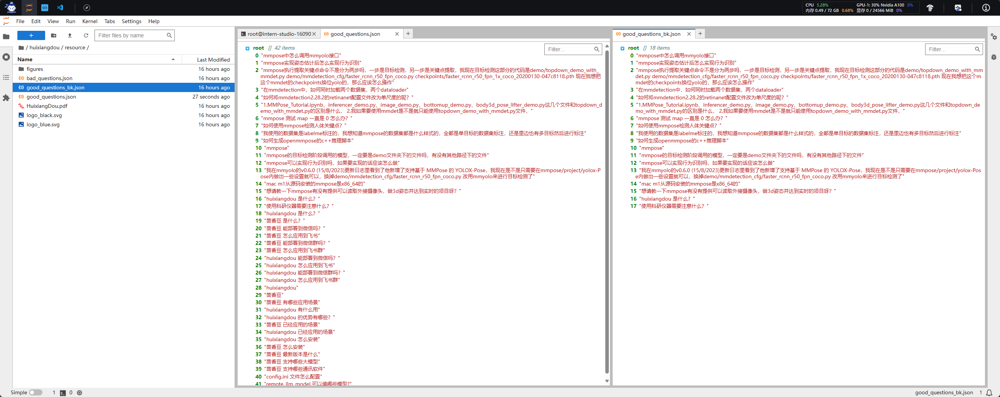

##### 3.5.2.4 创建测试问题

  使用echo方法新增内容并创建test_queries.json文件

```bash
cd /root/huixiangdou

echo '[
"huixiangdou 是什么？",
"你好，介绍下自己"
]' > ./test_queries.json
```

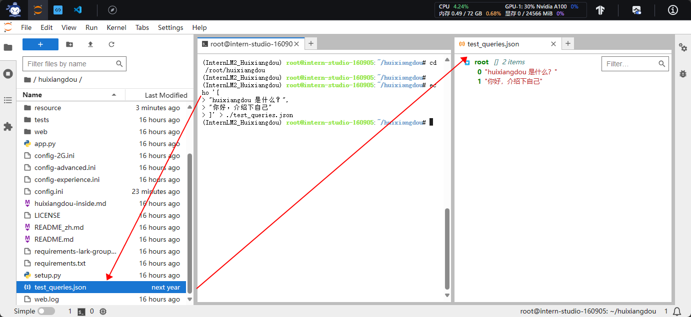

##### 3.5.2.5 创建知识库的向量库

- 新建workdir文件夹用于存储向量数据库

```bash
# 创建向量数据库存储目录
cd /root/huixiangdou && mkdir workdir 
```

- 创建向量数据库
```bash
# 分别向量化知识语料、接受问题和拒绝问题中后保存到 workdir
python3 -m huixiangdou.service.feature_store --sample ./test_queries.json
```

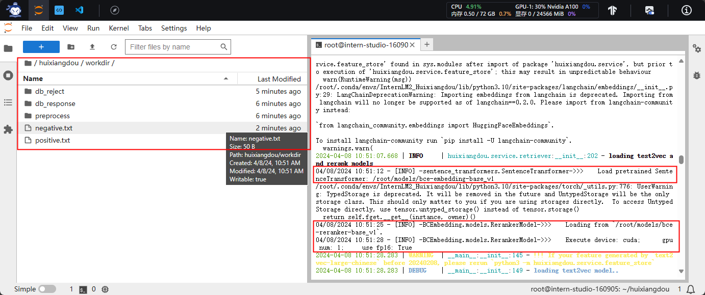

  检索过程中，茴香豆会将输入问题与两个列表中的问题在向量空间进行相似性比较，判断该问题是否应该回答，避免群聊过程中的问答泛滥。确定的回答的问题会利用基础模型提取关键词，在知识库中检索 top K 相似的 chunk，综合问题和检索到的 chunk 生成答案。

#### 3.5.3 运行茴香豆RAG助手

测试向量数据库方式存储的知识库。实现RAG检索后发送给大模型。

##### 3.5.3.1 修改main.py文件中的问题

- 使用命令行sed方式对main文件进行修改

```bash
# 填入问题
sed -i '74s/.*/    queries = ["huixiangdou 是什么？", "茴香豆怎么部署到微信群", "今天天气怎么样？"]/' /root/huixiangdou/huixiangdou/main.py
```

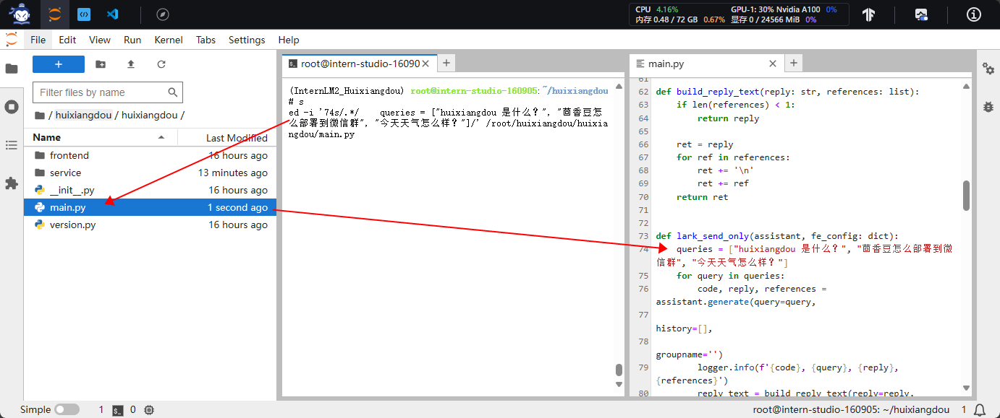

- 运行问题

```bash
# 运行茴香豆
cd /root/huixiangdou/
python3 -m huixiangdou.main --standalone
```

  RAG 技术的优势就是非参数化的模型调优，这里使用的仍然是基础模型 InternLM2-Chat-7B， 没有任何额外数据的训练。（简而言之：***外挂向量化的知识库——>向量检索排序——>结果给大模型作为上下文进行对话——>标识出处***）
  面对同样的问题，我们的茴香豆技术助理能够根据我们提供的数据库生成准确的答案：

  - Q1:huixiangdou 是什么？
    - A：

  - Q2:茴香豆怎么部署到微信群?
    - A:

  - Q3:今天天气怎么样？
    - A:ErrorCode.UNRELATED
    

### 3.6 联网搜索

#### 3.6.1 Serper API调用

- 获取[API key](https://serper.dev/api-key)


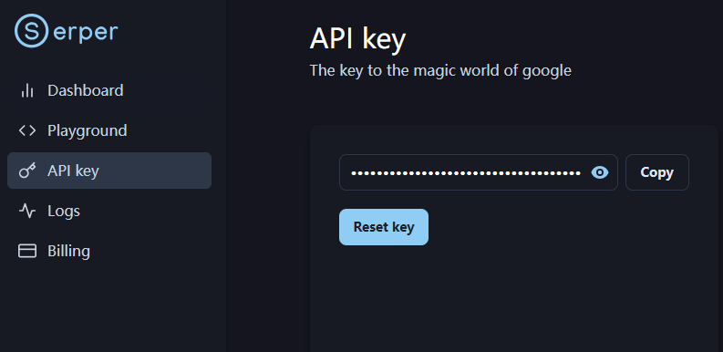

- 修改config配置文件填写key

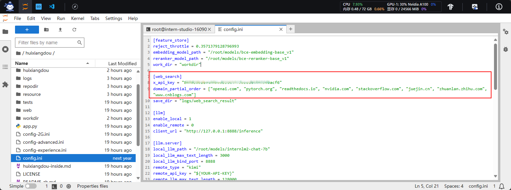

### 3.7 其他大模型接口调用

#### 3.7.1 修改配置文件

```bash
enable_local = 0 # 关闭本地模型
enable_remote = 1 # 启用云端模型
```
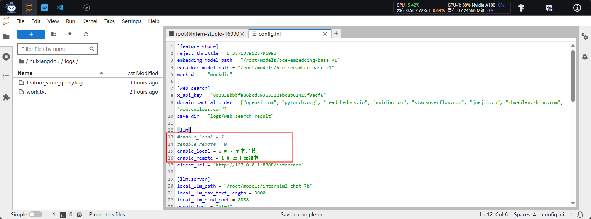

#### 3.7.2 创建kimi大模型API key

- [月球背面API key地址](https://platform.moonshot.cn/console/api-keys)

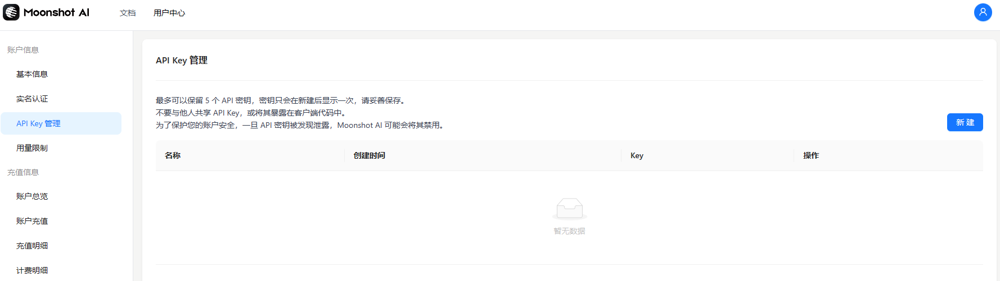

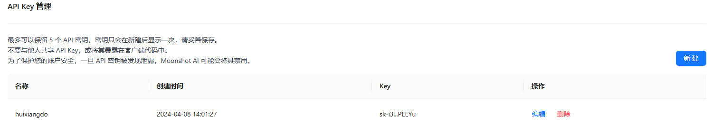

- 添加key到config配置文件

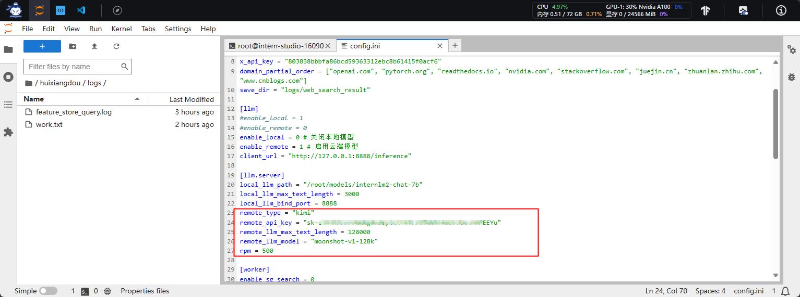

### 3.8 网页demo

#### 3.8.1 安装gradio依赖包

```bash
conda activate InternLM2_Huixiangdou
pip install gradio==4.25.0 redis==5.0.3 flask==3.0.2 lark_oapi==1.2.4
```

#### 3.8.2 运行demo服务

```bash
cd /root/huixiangdou
python3 -m tests.test_query_gradio 
```
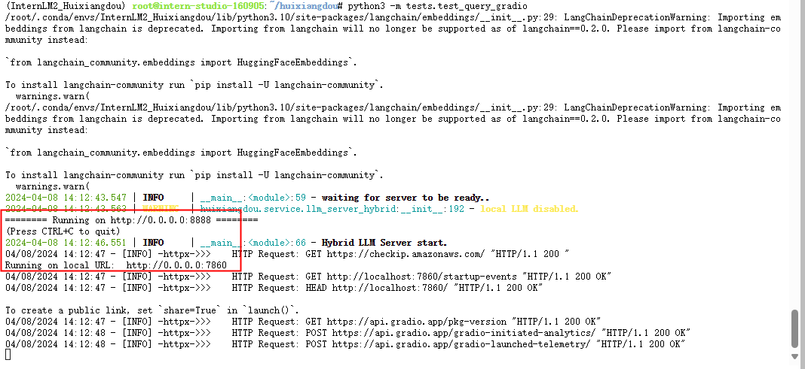

#### 3.8.3 本地映射访问

```bash
ssh -CNg -L 7860:127.0.0.1:7860 root@ssh.intern-ai.org.cn -p 41886
```
本地访问地址：http://127.0.0.1:7860/


注意：提问需要带问号，不带问号识别不出是疑问句。。。


## 4. web版茴香豆笔记

[web版OpenXLab地址](https://openxlab.org.cn/apps/detail/tpoisonooo/huixiangdou-web)

- 首页输入知识库名&密码
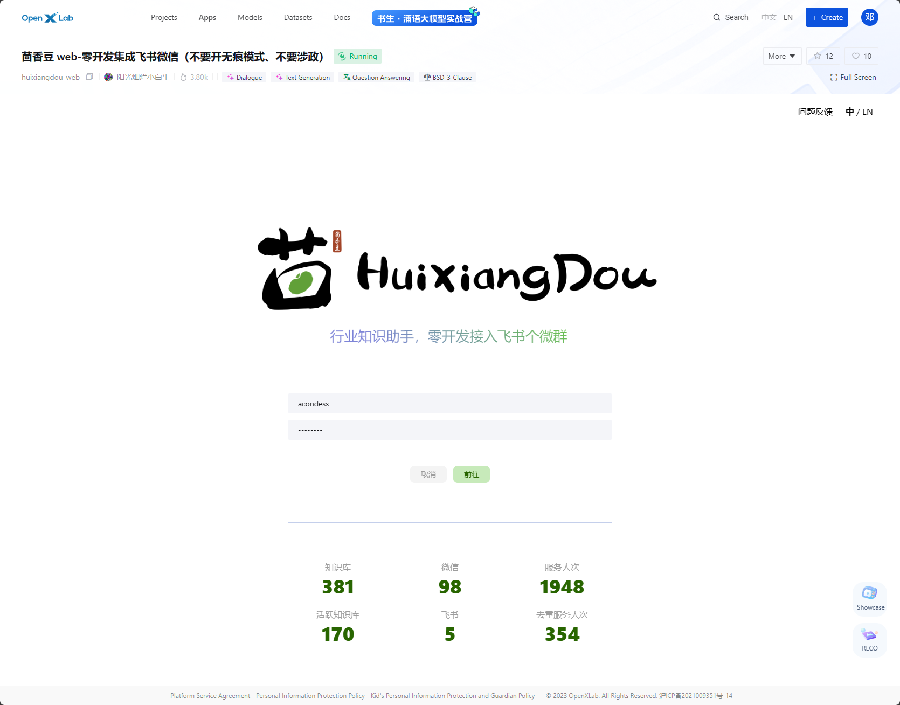

- 上传文档（奇绩论坛（陆奇深圳演讲））

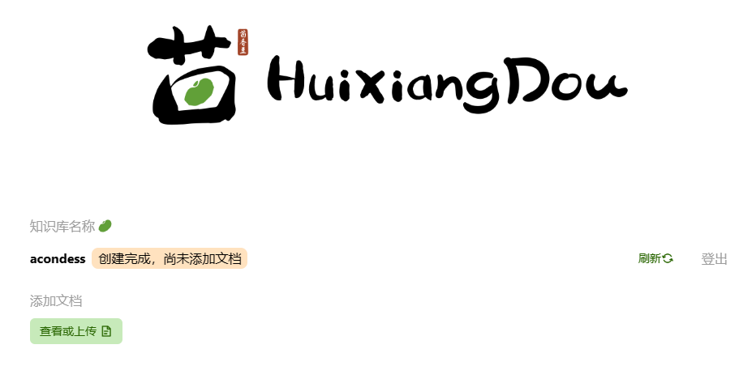

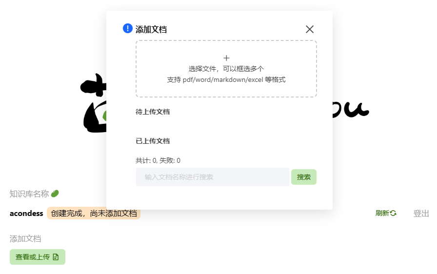

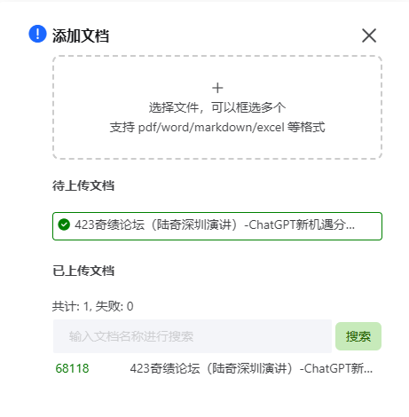

- 聊天测试


