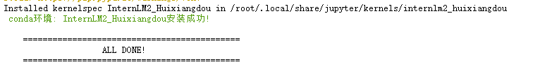
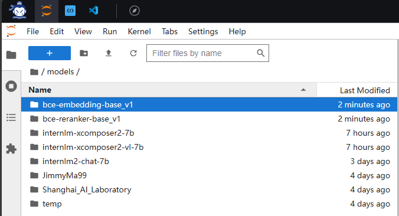
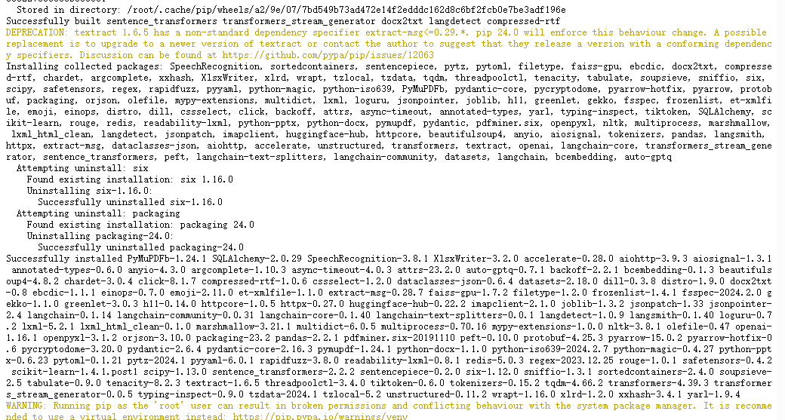
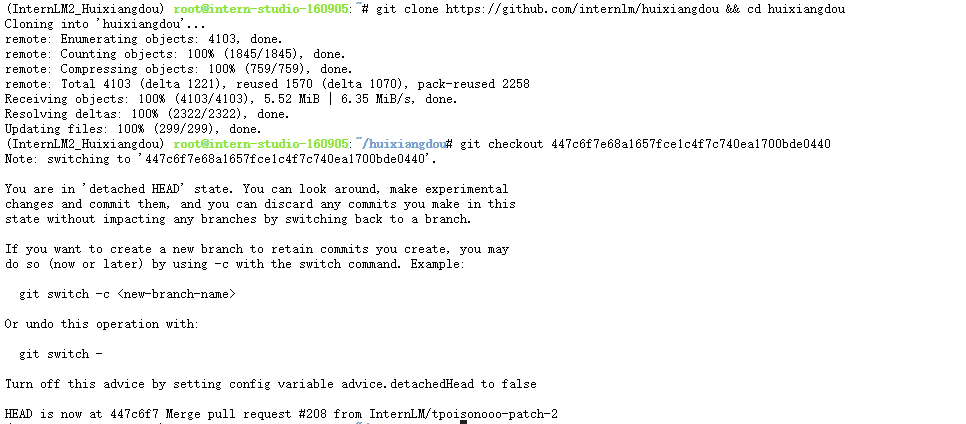

# 课时三 "茴香豆":零代码搭建你的 RAG 智能助理


[飞书地址](https://aicarrier.feishu.cn/wiki/Vv4swUFMni5DiMkcasUczUp9nid#LSBkd2cTHorhsAx5jZAcO0B3nqe)

 [算力平台](https://studio.intern-ai.org.cn/)

## 1. 提交的作业结果

[作业要求](https://github.com/InternLM/Tutorial/blob/camp2/huixiangdou/homework.md)

### 1.1 茴香豆web版部署知识问答助手

### 1.2 茴香豆技术助手

### 1.3 进阶作业

### 1.4 大作业项目

## 2. 视频笔记

[视频地址](https://www.bilibili.com/video/BV1QA4m1F7t4/)

## 3. 文档笔记

[文档地址](https://github.com/InternLM/Tutorial/blob/camp2/huixiangdou/readme.md)

### 3.1 创建huixiangdou环境（conda）

```bash
studio-conda -o internlm-base -t InternLM2_Huixiangdou
```


- 进入huixiangdou环境

```bash
conda activate InternLM2_Huixiangdou
```


### 3.2 模型文件

#### 3.2.1 RAG模型
- Github地址
  
  - [BCEmbedding](https://github.com/netease-youdao/BCEmbedding/blob/master/README_zh.md)

| 模型名称              |      模型类型      | 支持语种 | 参数量 |                                                                           开源权重                                                                           |
| :-------------------- | :----------------: | :------: | :----: | :-----------------------------------------------------------------------------------------------------------------------------------------------------------: |
| bce-embedding-base_v1 | `EmbeddingModel` |   中英   |  279M  | [Huggingface(推荐)](https://huggingface.co/maidalun1020/bce-embedding-base_v1), [国内通道](https://hf-mirror.com/maidalun1020/bce-embedding-base_v1), [ModelScope](https://www.modelscope.cn/models/maidalun/bce-embedding-base_v1/summary), [WiseModel](https://wisemodel.cn/models/Netease_Youdao/bce-embedding-base_v1) |
| bce-reranker-base_v1  | `RerankerModel` | 中英日韩 |  279M  |  [Huggingface(推荐)](https://huggingface.co/maidalun1020/bce-reranker-base_v1), [国内通道](https://hf-mirror.com/maidalun1020/bce-reranker-base_v1), [ModelScope](https://www.modelscope.cn/models/maidalun/bce-reranker-base_v1/summary), [WiseModel](https://wisemodel.cn/models/Netease_Youdao/bce-reranker-base_v1) |

#### 3.2.2 share模型软链接

```bash
# 创建模型文件夹
cd /root && mkdir models

# 复制BCE模型
ln -s /root/share/new_models/maidalun1020/bce-embedding-base_v1 /root/models/bce-embedding-base_v1
ln -s /root/share/new_models/maidalun1020/bce-reranker-base_v1 /root/models/bce-reranker-base_v1

# 复制大模型参数（下面的模型，根据作业进度和任务进行**选择一个**就行）
ln -s /root/share/new_models/Shanghai_AI_Laboratory/internlm2-chat-7b /root/models/internlm2-chat-7b
```


### 3.3 下载安装茴香豆

#### 3.3.1 安装茴香豆依赖包

```bash
# 安装 python 依赖
# pip install -r requirements.txt

pip install protobuf==4.25.3 accelerate==0.28.0 aiohttp==3.9.3 auto-gptq==0.7.1 bcembedding==0.1.3 beautifulsoup4==4.8.2 einops==0.7.0 faiss-gpu==1.7.2 langchain==0.1.14 loguru==0.7.2 lxml_html_clean==0.1.0 openai==1.16.1 openpyxl==3.1.2 pandas==2.2.1 pydantic==2.6.4 pymupdf==1.24.1 python-docx==1.1.0 pytoml==0.1.21 readability-lxml==0.8.1 redis==5.0.3 requests==2.31.0 scikit-learn==1.4.1.post1 sentence_transformers==2.2.2 textract==1.6.5 tiktoken==0.6.0 transformers==4.39.3 transformers_stream_generator==0.0.5 unstructured==0.11.2

## 因为 Intern Studio 不支持对系统文件的永久修改，在 Intern Studio 安装部署的同学不建议安装 Word 依赖，后续的操作和作业不会涉及 Word 解析。
## 想要自己尝试解析 Word 文件的同学，uncomment 掉下面这行，安装解析 .doc .docx 必需的依赖
# apt update && apt -y install python-dev python libxml2-dev libxslt1-dev antiword unrtf poppler-utils pstotext tesseract-ocr flac ffmpeg lame libmad0 libsox-fmt-mp3 sox libjpeg-dev swig libpulse-dev
```




#### 3.3.2 获取茴香豆源码

```bash
cd /root
# 下载 repo
git clone https://github.com/internlm/huixiangdou && cd huixiangdou
git checkout 447c6f7e68a1657fce1c4f7c740ea1700bde0440
```
