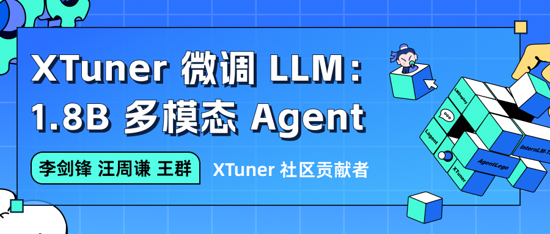

# 课时四 XTuner微调多模态Agent

[飞书地址](https://aicarrier.feishu.cn/wiki/Vv4swUFMni5DiMkcasUczUp9nid#LSBkd2cTHorhsAx5jZAcO0B3nqe)

 [算力平台](https://studio.intern-ai.org.cn/)

 ## 1. 提交的作业结果

 [作业要求](https://github.com/InternLM/Tutorial/blob/camp2/xtuner/homework.md)

 ### 1.1 训练自己的小助手认知（记录复现过程并截图）

 - 训练完小助手对话截图：

 - 复现笔记：

 ### 1.2 将自我认知的模型上传到 OpenXLab，并将应用部署到 OpenXLab

 ### 1.3  复现多模态微调