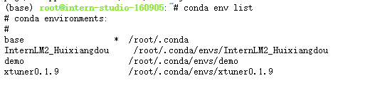
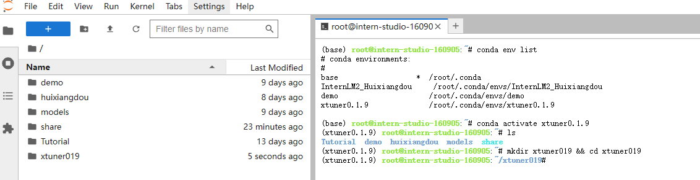
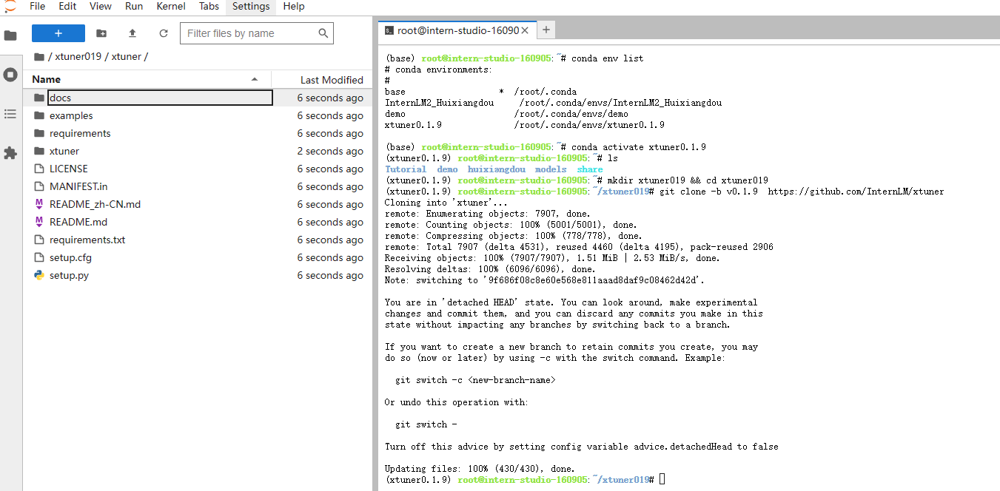
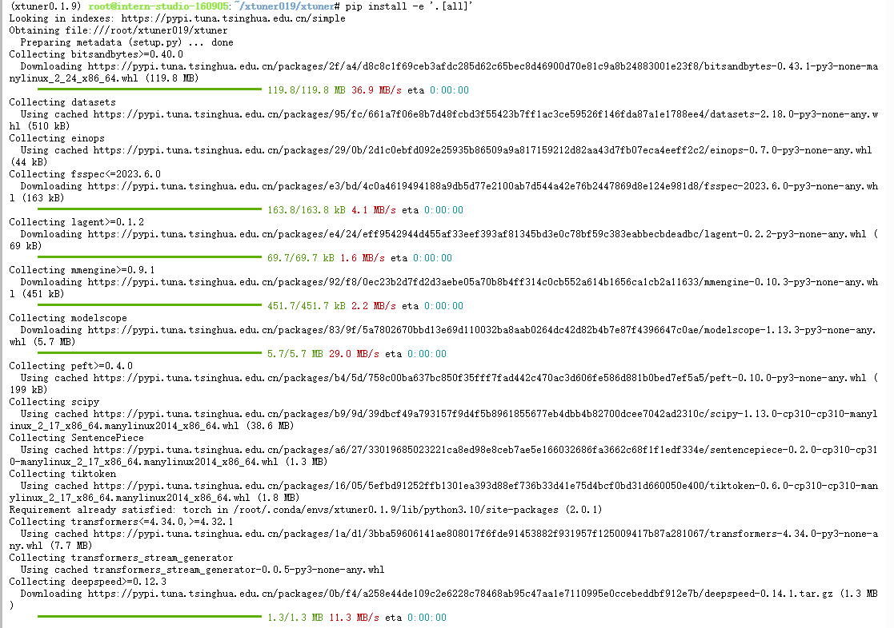
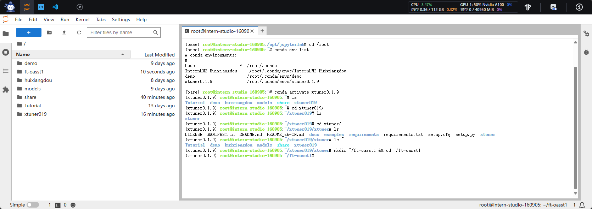
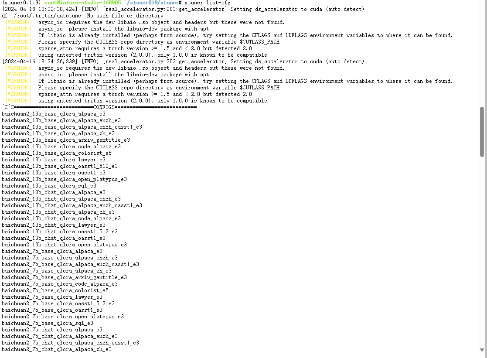
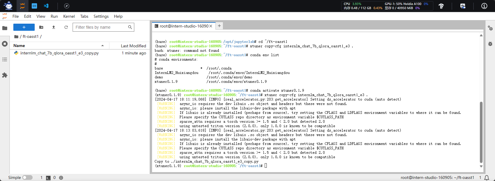
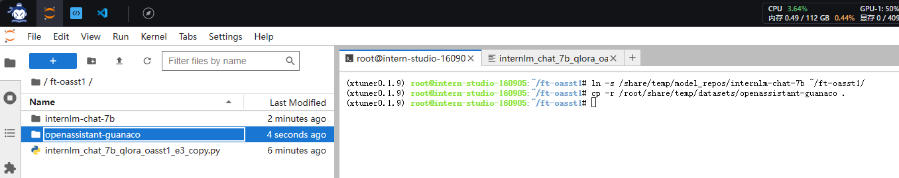
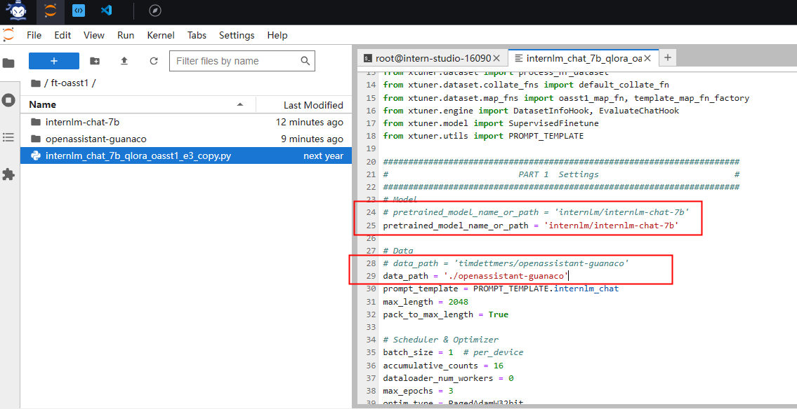
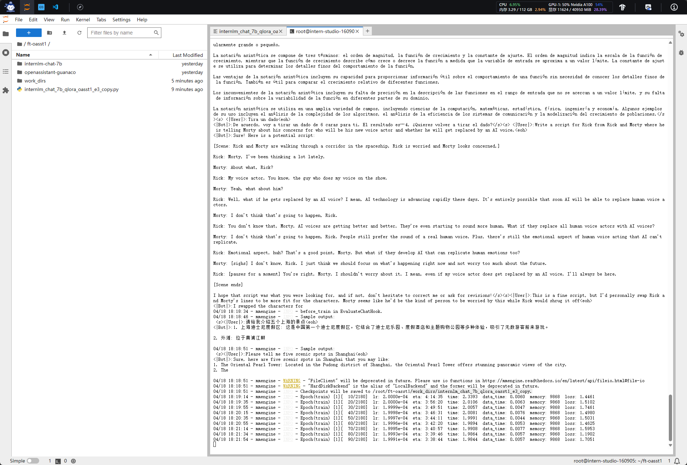

# 课时四 XTuner微调多模态Agent


[飞书地址](https://aicarrier.feishu.cn/wiki/Vv4swUFMni5DiMkcasUczUp9nid#LSBkd2cTHorhsAx5jZAcO0B3nqe)

[算力平台](https://studio.intern-ai.org.cn/)

## 1. 提交的作业结果

[作业要求](https://github.com/InternLM/Tutorial/blob/camp2/xtuner/homework.md)

### 1.1 训练自己的小助手认知（记录复现过程并截图）

- 训练完小助手对话截图：
- 复现笔记：

### 1.2 将自我认知的模型上传到 OpenXLab，并将应用部署到 OpenXLab

### 1.3  复现多模态微调

## 2. 文档复现笔记

[文档地址](https://github.com/InternLM/tutorial/blob/main/xtuner/README.md)

### 2.1 前置知识

### 2.2 复现步骤

#### 2.2.1 环境配置

- 创建开发机


- 进入开发机创建conda环境

```bash
cd /root
/share/install_conda_env_internlm_base.sh xtuner0.1.9
```



- 激活xtuner0.1.9环境&创建文件夹

```bash
conda activate xtuner0.1.9
cd /root
mkdir xtuner019 && cd xtuner019
```



- 获取0.1.9版本源码

```bash
git clone -b v0.1.9  https://github.com/InternLM/xtuner
```


- 从源码安装Xtuner

```bash
cd xtuner
pip install -e '.[all]'
```



- 创建数据集文件夹地址

```bash
# 创建一个微调 oasst1 数据集的工作路径，进入
mkdir ~/ft-oasst1 && cd ~/ft-oasst1
```



#### 2.2.2 微调

##### 2.2.2.1 准备配置文件

```bash
# 列出所有内置配置
xtuner list-cfg
```
>假如显示bash: xtuner: command not found的话可以考虑在终端输入 export PATH=$PATH:'/root/.local/bin'

我是又执行了一遍源码安装命令

```bash
cd xtuner
pip install -e '.[all]'
```

- 配置文件
```bash
xtuner list-cfg
```



<details>
<summary>展开内容</summary>
```bash
==========================CONFIGS===========================
baichuan2_13b_base_qlora_alpaca_e3
baichuan2_13b_base_qlora_alpaca_enzh_e3
baichuan2_13b_base_qlora_alpaca_enzh_oasst1_e3
baichuan2_13b_base_qlora_alpaca_zh_e3
baichuan2_13b_base_qlora_arxiv_gentitle_e3
baichuan2_13b_base_qlora_code_alpaca_e3
baichuan2_13b_base_qlora_colorist_e5
baichuan2_13b_base_qlora_lawyer_e3
baichuan2_13b_base_qlora_oasst1_512_e3
baichuan2_13b_base_qlora_oasst1_e3
baichuan2_13b_base_qlora_open_platypus_e3
baichuan2_13b_base_qlora_sql_e3
baichuan2_13b_chat_qlora_alpaca_e3
baichuan2_13b_chat_qlora_alpaca_enzh_e3
baichuan2_13b_chat_qlora_alpaca_enzh_oasst1_e3
baichuan2_13b_chat_qlora_alpaca_zh_e3
baichuan2_13b_chat_qlora_code_alpaca_e3
baichuan2_13b_chat_qlora_lawyer_e3
baichuan2_13b_chat_qlora_oasst1_512_e3
baichuan2_13b_chat_qlora_oasst1_e3
baichuan2_13b_chat_qlora_open_platypus_e3
baichuan2_7b_base_qlora_alpaca_e3
baichuan2_7b_base_qlora_alpaca_enzh_e3
baichuan2_7b_base_qlora_alpaca_enzh_oasst1_e3
baichuan2_7b_base_qlora_alpaca_zh_e3
baichuan2_7b_base_qlora_arxiv_gentitle_e3
baichuan2_7b_base_qlora_code_alpaca_e3
baichuan2_7b_base_qlora_colorist_e5
baichuan2_7b_base_qlora_lawyer_e3
baichuan2_7b_base_qlora_oasst1_512_e3
baichuan2_7b_base_qlora_oasst1_e3
baichuan2_7b_base_qlora_open_platypus_e3
baichuan2_7b_base_qlora_sql_e3
baichuan2_7b_chat_qlora_alpaca_e3
baichuan2_7b_chat_qlora_alpaca_enzh_e3
baichuan2_7b_chat_qlora_alpaca_enzh_oasst1_e3
baichuan2_7b_chat_qlora_alpaca_zh_e3
baichuan2_7b_chat_qlora_code_alpaca_e3
baichuan2_7b_chat_qlora_lawyer_e3
baichuan2_7b_chat_qlora_oasst1_512_e3
baichuan2_7b_chat_qlora_oasst1_e3
baichuan2_7b_chat_qlora_open_platypus_e3
baichuan_13b_base_qlora_alpaca_e3
baichuan_13b_base_qlora_alpaca_enzh_e3
baichuan_13b_base_qlora_alpaca_enzh_oasst1_e3
baichuan_13b_base_qlora_alpaca_zh_e3
baichuan_13b_base_qlora_arxiv_gentitle_e3
baichuan_13b_base_qlora_code_alpaca_e3
baichuan_13b_base_qlora_colorist_e5
baichuan_13b_base_qlora_lawyer_e3
baichuan_13b_base_qlora_medical_e1
baichuan_13b_base_qlora_moss_sft_all_e1
baichuan_13b_base_qlora_moss_sft_all_e2_gpu8
baichuan_13b_base_qlora_moss_sft_plugins_e1
baichuan_13b_base_qlora_oasst1_512_e3
baichuan_13b_base_qlora_oasst1_e3
baichuan_13b_base_qlora_open_platypus_e3
baichuan_13b_base_qlora_openorca_e1
baichuan_13b_base_qlora_sql_e3
baichuan_13b_base_qlora_tiny_codes_e1
baichuan_13b_chat_qlora_alpaca_e3
baichuan_13b_chat_qlora_alpaca_enzh_e3
baichuan_13b_chat_qlora_alpaca_enzh_oasst1_e3
baichuan_13b_chat_qlora_alpaca_zh_e3
baichuan_13b_chat_qlora_arxiv_gentitle_e3
baichuan_13b_chat_qlora_code_alpaca_e3
baichuan_13b_chat_qlora_colorist_e5
baichuan_13b_chat_qlora_lawyer_e3
baichuan_13b_chat_qlora_medical_e1
baichuan_13b_chat_qlora_oasst1_512_e3
baichuan_13b_chat_qlora_oasst1_e3
baichuan_13b_chat_qlora_open_platypus_e3
baichuan_13b_chat_qlora_openorca_e1
baichuan_13b_chat_qlora_sql_e3
baichuan_13b_chat_qlora_tiny_codes_e1
baichuan_7b_qlora_alpaca_e3
baichuan_7b_qlora_alpaca_enzh_e3
baichuan_7b_qlora_alpaca_enzh_oasst1_e3
baichuan_7b_qlora_alpaca_zh_e3
baichuan_7b_qlora_arxiv_gentitle_e3
baichuan_7b_qlora_code_alpaca_e3
baichuan_7b_qlora_colorist_e5
baichuan_7b_qlora_lawyer_e3
baichuan_7b_qlora_medical_e1
baichuan_7b_qlora_moss_sft_all_e1
baichuan_7b_qlora_moss_sft_all_e2_gpu8
baichuan_7b_qlora_moss_sft_plugins_e1
baichuan_7b_qlora_oasst1_512_e3
baichuan_7b_qlora_oasst1_e3
baichuan_7b_qlora_open_platypus_e3
baichuan_7b_qlora_openorca_e1
baichuan_7b_qlora_sql_e3
baichuan_7b_qlora_tiny_codes_e1
chatglm2_6b_qlora_alpaca_e3
chatglm2_6b_qlora_alpaca_enzh_e3
chatglm2_6b_qlora_alpaca_enzh_oasst1_e3
chatglm2_6b_qlora_alpaca_zh_e3
chatglm2_6b_qlora_arxiv_gentitle_e3
chatglm2_6b_qlora_code_alpaca_e3
chatglm2_6b_qlora_colorist_e5
chatglm2_6b_qlora_lawyer_e3
chatglm2_6b_qlora_medical_e1
chatglm2_6b_qlora_oasst1_512_e3
chatglm2_6b_qlora_oasst1_e3
chatglm2_6b_qlora_open_platypus_e3
chatglm2_6b_qlora_openorca_e1
chatglm2_6b_qlora_sql_e3
chatglm2_6b_qlora_tiny_codes_e1
chatglm3_6b_base_qlora_alpaca_e3
chatglm3_6b_base_qlora_alpaca_enzh_e3
chatglm3_6b_base_qlora_alpaca_enzh_oasst1_e3
chatglm3_6b_base_qlora_alpaca_zh_e3
chatglm3_6b_base_qlora_arxiv_gentitle_e3
chatglm3_6b_base_qlora_code_alpaca_e3
chatglm3_6b_base_qlora_colorist_e5
chatglm3_6b_base_qlora_lawyer_e3
chatglm3_6b_base_qlora_medical_e1
chatglm3_6b_base_qlora_oasst1_512_e3
chatglm3_6b_base_qlora_oasst1_e3
chatglm3_6b_base_qlora_open_platypus_e3
chatglm3_6b_base_qlora_openorca_e1
chatglm3_6b_base_qlora_sql_e3
chatglm3_6b_base_qlora_tiny_codes_e1
chatglm3_6b_qlora_alpaca_e3
chatglm3_6b_qlora_alpaca_enzh_e3
chatglm3_6b_qlora_alpaca_enzh_oasst1_e3
chatglm3_6b_qlora_alpaca_zh_e3
chatglm3_6b_qlora_arxiv_gentitle_e3
chatglm3_6b_qlora_code_alpaca_e3
chatglm3_6b_qlora_colorist_e5
chatglm3_6b_qlora_lawyer_e3
chatglm3_6b_qlora_medical_e1
chatglm3_6b_qlora_oasst1_512_e3
chatglm3_6b_qlora_oasst1_e3
chatglm3_6b_qlora_open_platypus_e3
chatglm3_6b_qlora_openorca_e1
chatglm3_6b_qlora_sql_e3
chatglm3_6b_qlora_tiny_codes_e1
deepspeed_zero1
deepspeed_zero2
deepspeed_zero2_offload
deepspeed_zero3
deepspeed_zero3_offload
internlm_20b_qlora_alpaca_e3
internlm_20b_qlora_alpaca_enzh_e3
internlm_20b_qlora_alpaca_enzh_oasst1_e3
internlm_20b_qlora_alpaca_zh_e3
internlm_20b_qlora_arxiv_gentitle_e3
internlm_20b_qlora_code_alpaca_e3
internlm_20b_qlora_colorist_e5
internlm_20b_qlora_lawyer_e3
internlm_20b_qlora_msagent_react_e3_gpu8
internlm_20b_qlora_oasst1_512_e3
internlm_20b_qlora_oasst1_e3
internlm_20b_qlora_open_platypus_e3
internlm_20b_qlora_sql_e3
internlm_7b_full_alpaca_e3
internlm_7b_full_alpaca_enzh_e3
internlm_7b_full_alpaca_enzh_oasst1_e3
internlm_7b_full_alpaca_zh_e3
internlm_7b_full_oasst1_e3
internlm_7b_qlora_alpaca_e3
internlm_7b_qlora_alpaca_enzh_e3
internlm_7b_qlora_alpaca_enzh_oasst1_e3
internlm_7b_qlora_alpaca_zh_e3
internlm_7b_qlora_arxiv_gentitle_e3
internlm_7b_qlora_code_alpaca_e3
internlm_7b_qlora_colorist_e5
internlm_7b_qlora_lawyer_e3
internlm_7b_qlora_medical_e1
internlm_7b_qlora_moss_sft_all_e1
internlm_7b_qlora_moss_sft_all_e2_gpu8
internlm_7b_qlora_moss_sft_plugins_e1
internlm_7b_qlora_msagent_react_e3_gpu8
internlm_7b_qlora_oasst1_512_e3
internlm_7b_qlora_oasst1_e3
internlm_7b_qlora_oasst1_e3_hf
internlm_7b_qlora_oasst1_mmlu_e3
internlm_7b_qlora_open_platypus_e3
internlm_7b_qlora_openorca_e1
internlm_7b_qlora_sql_e3
internlm_7b_qlora_tiny_codes_e1
internlm_chat_20b_qlora_alpaca_e3
internlm_chat_20b_qlora_alpaca_enzh_e3
internlm_chat_20b_qlora_alpaca_enzh_oasst1_e3
internlm_chat_20b_qlora_alpaca_zh_e3
internlm_chat_20b_qlora_code_alpaca_e3
internlm_chat_20b_qlora_lawyer_e3
internlm_chat_20b_qlora_oasst1_512_e3
internlm_chat_20b_qlora_oasst1_e3
internlm_chat_20b_qlora_open_platypus_e3
internlm_chat_7b_qlora_alpaca_e3
internlm_chat_7b_qlora_alpaca_enzh_e3
internlm_chat_7b_qlora_alpaca_enzh_oasst1_e3
internlm_chat_7b_qlora_alpaca_zh_e3
internlm_chat_7b_qlora_arxiv_gentitle_e3
internlm_chat_7b_qlora_code_alpaca_e3
internlm_chat_7b_qlora_colorist_e5
internlm_chat_7b_qlora_lawyer_e3
internlm_chat_7b_qlora_medical_e1
internlm_chat_7b_qlora_oasst1_512_e3
internlm_chat_7b_qlora_oasst1_e3
internlm_chat_7b_qlora_open_platypus_e3
internlm_chat_7b_qlora_openorca_e1
internlm_chat_7b_qlora_sql_e3
internlm_chat_7b_qlora_tiny_codes_e1
llama2_70b_int8_lora_open_platypus_e1
llama2_70b_int8_lora_open_platypus_e1_hf
llama2_70b_qlora_open_platypus_e1
llama2_70b_qlora_open_platypus_e1_hf
llama2_7b_chat_qlora_alpaca_e3
llama2_7b_chat_qlora_alpaca_enzh_e3
llama2_7b_chat_qlora_alpaca_enzh_oasst1_e3
llama2_7b_chat_qlora_alpaca_zh_e3
llama2_7b_chat_qlora_arxiv_gentitle_e3
llama2_7b_chat_qlora_code_alpaca_e3
llama2_7b_chat_qlora_colorist_e5
llama2_7b_chat_qlora_lawyer_e3
llama2_7b_chat_qlora_medical_e1
llama2_7b_chat_qlora_oasst1_512_e3
llama2_7b_chat_qlora_oasst1_e3
llama2_7b_chat_qlora_open_platypus_e3
llama2_7b_chat_qlora_openorca_e1
llama2_7b_chat_qlora_sql_e3
llama2_7b_chat_qlora_tiny_codes_e1
llama2_7b_full_wizardlm_e1
llama2_7b_qlora_alpaca_e3
llama2_7b_qlora_alpaca_enzh_e3
llama2_7b_qlora_alpaca_enzh_oasst1_e3
llama2_7b_qlora_alpaca_zh_e3
llama2_7b_qlora_arxiv_gentitle_e3
llama2_7b_qlora_code_alpaca_e3
llama2_7b_qlora_colorist_e5
llama2_7b_qlora_lawyer_e3
llama2_7b_qlora_medical_e1
llama2_7b_qlora_moss_sft_all_e1
llama2_7b_qlora_moss_sft_all_e2_gpu8
llama2_7b_qlora_moss_sft_plugins_e1
llama2_7b_qlora_msagent_react_e3_gpu8
llama2_7b_qlora_oasst1_512_e3
llama2_7b_qlora_oasst1_e3
llama2_7b_qlora_open_platypus_e3
llama2_7b_qlora_openorca_e1
llama2_7b_qlora_sql_e3
llama2_7b_qlora_tiny_codes_e1
llama_7b_qlora_alpaca_e3
llama_7b_qlora_alpaca_enzh_e3
llama_7b_qlora_alpaca_enzh_oasst1_e3
llama_7b_qlora_alpaca_zh_e3
llama_7b_qlora_arxiv_gentitle_e3
llama_7b_qlora_code_alpaca_e3
llama_7b_qlora_colorist_e5
llama_7b_qlora_lawyer_e3
llama_7b_qlora_medical_e1
llama_7b_qlora_moss_sft_all_e1
llama_7b_qlora_moss_sft_all_e2_gpu8
llama_7b_qlora_moss_sft_plugins_e1
llama_7b_qlora_oasst1_512_e3
llama_7b_qlora_oasst1_e3
llama_7b_qlora_open_platypus_e3
llama_7b_qlora_openorca_e1
llama_7b_qlora_sql_e3
llama_7b_qlora_tiny_codes_e1
mistral_7b_qlora_skypile_pretrain_e1
qwen_7b_chat_qlora_alpaca_e3
qwen_7b_chat_qlora_alpaca_enzh_e3
qwen_7b_chat_qlora_alpaca_enzh_oasst1_e3
qwen_7b_chat_qlora_alpaca_zh_e3
qwen_7b_chat_qlora_arxiv_gentitle_e3
qwen_7b_chat_qlora_code_alpaca_e3
qwen_7b_chat_qlora_colorist_e5
qwen_7b_chat_qlora_lawyer_e3
qwen_7b_chat_qlora_medical_e1
qwen_7b_chat_qlora_oasst1_512_e3
qwen_7b_chat_qlora_oasst1_e3
qwen_7b_chat_qlora_open_platypus_e3
qwen_7b_chat_qlora_openorca_e1
qwen_7b_chat_qlora_sql_e3
qwen_7b_chat_qlora_tiny_codes_e1
qwen_7b_qlora_alpaca_e3
qwen_7b_qlora_alpaca_enzh_e3
qwen_7b_qlora_alpaca_enzh_oasst1_e3
qwen_7b_qlora_alpaca_zh_e3
qwen_7b_qlora_arxiv_gentitle_e3
qwen_7b_qlora_code_alpaca_e3
qwen_7b_qlora_colorist_e5
qwen_7b_qlora_lawyer_e3
qwen_7b_qlora_medical_e1
qwen_7b_qlora_moss_sft_all_e1
qwen_7b_qlora_moss_sft_all_e2_gpu8
qwen_7b_qlora_moss_sft_plugins_e1
qwen_7b_qlora_oasst1_512_e3
qwen_7b_qlora_oasst1_e3
qwen_7b_qlora_open_platypus_e3
qwen_7b_qlora_openorca_e1
qwen_7b_qlora_sql_e3
qwen_7b_qlora_tiny_codes_e1
starcoder_qlora_stack_exchange_example
yi_34b_qlora_alpaca_enzh_e3
yi_6b_qlora_alpaca_enzh_e3
zephyr_7b_beta_qlora_alpaca_e3
=============================================================
```
</details> 

- 拷贝一个配置文件到当前目录：
```bash
cd ~/ft-oasst1
xtuner copy-cfg internlm_chat_7b_qlora_oasst1_e3 .
```


##### 2.2.2.2 模型设置

- 设置软链接

```bash
ln -s /share/temp/model_repos/internlm-chat-7b ~/ft-oasst1/
```


##### 2.2.2.3 数据集下载

[数据集Huggingface地址](https://huggingface.co/datasets/timdettmers/openassistant-guanaco/tree/main)

- 从开发机share地址拷贝到ft-oasst1文件夹下
```bash
cd ~/ft-oasst1
# ...-guanaco 后面有个空格和英文句号啊
cp -r /root/share/temp/datasets/openassistant-guanaco .
```



##### 2.2.2.4 修改配置文件

- 修改internlm_chat_7b_qlora_oasst1_e3_copy.py配置文件模型及数据为本地模型及数据

```python
# pretrained_model_name_or_path = 'internlm/internlm-chat-7b'
pretrained_model_name_or_path = 'internlm/internlm-chat-7b'

# Data
# data_path = 'timdettmers/openassistant-guanaco'
data_path = './openassistant-guanaco'
```



修改后的配置文件internlm_chat_7b_qlora_oasst1_e3_copy.py

<details>
<summary>internlm_chat_7b_qlora_oasst1_e3_copy.py</summary>

``` python  linenums="1"
# Copyright (c) OpenMMLab. All rights reserved.
import torch
from bitsandbytes.optim import PagedAdamW32bit
from datasets import load_dataset
from mmengine.dataset import DefaultSampler
from mmengine.hooks import (CheckpointHook, DistSamplerSeedHook, IterTimerHook,
                            LoggerHook, ParamSchedulerHook)
from mmengine.optim import AmpOptimWrapper, CosineAnnealingLR
from peft import LoraConfig
from transformers import (AutoModelForCausalLM, AutoTokenizer,
                          BitsAndBytesConfig)

from xtuner.dataset import process_hf_dataset
from xtuner.dataset.collate_fns import default_collate_fn
from xtuner.dataset.map_fns import oasst1_map_fn, template_map_fn_factory
from xtuner.engine import DatasetInfoHook, EvaluateChatHook
from xtuner.model import SupervisedFinetune
from xtuner.utils import PROMPT_TEMPLATE

#######################################################################
#                          PART 1  Settings                           #
#######################################################################
# Model
# pretrained_model_name_or_path = 'internlm/internlm-chat-7b'
pretrained_model_name_or_path = './internlm-chat-7b'

# Data
# data_path = 'timdettmers/openassistant-guanaco'
data_path = './openassistant-guanaco'
prompt_template = PROMPT_TEMPLATE.internlm_chat
max_length = 2048
pack_to_max_length = True

# Scheduler & Optimizer
batch_size = 1  # per_device
accumulative_counts = 16
dataloader_num_workers = 0
max_epochs = 3
optim_type = PagedAdamW32bit
lr = 2e-4
betas = (0.9, 0.999)
weight_decay = 0
max_norm = 1  # grad clip

# Evaluate the generation performance during the training
evaluation_freq = 500
SYSTEM = ''
evaluation_inputs = [
    '请给我介绍五个上海的景点', 'Please tell me five scenic spots in Shanghai'
]

#######################################################################
#                      PART 2  Model & Tokenizer                      #
#######################################################################
tokenizer = dict(
    type=AutoTokenizer.from_pretrained,
    pretrained_model_name_or_path=pretrained_model_name_or_path,
    trust_remote_code=True,
    padding_side='right')

model = dict(
    type=SupervisedFinetune,
    llm=dict(
        type=AutoModelForCausalLM.from_pretrained,
        pretrained_model_name_or_path=pretrained_model_name_or_path,
        trust_remote_code=True,
        torch_dtype=torch.float16,
        quantization_config=dict(
            type=BitsAndBytesConfig,
            load_in_4bit=True,
            load_in_8bit=False,
            llm_int8_threshold=6.0,
            llm_int8_has_fp16_weight=False,
            bnb_4bit_compute_dtype=torch.float16,
            bnb_4bit_use_double_quant=True,
            bnb_4bit_quant_type='nf4')),
    lora=dict(
        type=LoraConfig,
        r=64,
        lora_alpha=16,
        lora_dropout=0.1,
        bias='none',
        task_type='CAUSAL_LM'))

#######################################################################
#                      PART 3  Dataset & Dataloader                   #
#######################################################################
train_dataset = dict(
    type=process_hf_dataset,
    dataset=dict(type=load_dataset, path=data_path),
    tokenizer=tokenizer,
    max_length=max_length,
    dataset_map_fn=oasst1_map_fn,
    template_map_fn=dict(
        type=template_map_fn_factory, template=prompt_template),
    remove_unused_columns=True,
    shuffle_before_pack=True,
    pack_to_max_length=pack_to_max_length)

train_dataloader = dict(
    batch_size=batch_size,
    num_workers=dataloader_num_workers,
    dataset=train_dataset,
    sampler=dict(type=DefaultSampler, shuffle=True),
    collate_fn=dict(type=default_collate_fn))

#######################################################################
#                    PART 4  Scheduler & Optimizer                    #
#######################################################################
# optimizer
optim_wrapper = dict(
    type=AmpOptimWrapper,
    optimizer=dict(
        type=optim_type, lr=lr, betas=betas, weight_decay=weight_decay),
    clip_grad=dict(max_norm=max_norm, error_if_nonfinite=False),
    accumulative_counts=accumulative_counts,
    loss_scale='dynamic',
    dtype='float16')

# learning policy
# More information: https://github.com/open-mmlab/mmengine/blob/main/docs/en/tutorials/param_scheduler.md  # noqa: E501
param_scheduler = dict(
    type=CosineAnnealingLR,
    eta_min=0.0,
    by_epoch=True,
    T_max=max_epochs,
    convert_to_iter_based=True)

# train, val, test setting
train_cfg = dict(by_epoch=True, max_epochs=max_epochs, val_interval=1)

#######################################################################
#                           PART 5  Runtime                           #
#######################################################################
# Log the dialogue periodically during the training process, optional
custom_hooks = [
    dict(type=DatasetInfoHook, tokenizer=tokenizer),
    dict(
        type=EvaluateChatHook,
        tokenizer=tokenizer,
        every_n_iters=evaluation_freq,
        evaluation_inputs=evaluation_inputs,
        system=SYSTEM,
        prompt_template=prompt_template)
]

# configure default hooks
default_hooks = dict(
    # record the time of every iteration.
    timer=dict(type=IterTimerHook),
    # print log every 100 iterations.
    logger=dict(type=LoggerHook, interval=10),
    # enable the parameter scheduler.
    param_scheduler=dict(type=ParamSchedulerHook),
    # save checkpoint per epoch.
    checkpoint=dict(type=CheckpointHook, interval=1),
    # set sampler seed in distributed evrionment.
    sampler_seed=dict(type=DistSamplerSeedHook),
)

# configure environment
env_cfg = dict(
    # whether to enable cudnn benchmark
    cudnn_benchmark=False,
    # set multi process parameters
    mp_cfg=dict(mp_start_method='fork', opencv_num_threads=0),
    # set distributed parameters
    dist_cfg=dict(backend='nccl'),
)

# set visualizer
visualizer = None

# set log level
log_level = 'INFO'

# load from which checkpoint
load_from = None

# whether to resume training from the loaded checkpoint
resume = False

# Defaults to use random seed and disable `deterministic`
randomness = dict(seed=None, deterministic=False)
```
</details>


##### 2.2.2.5 开始微调

- 训练

```bash
# 单卡
## 用刚才改好的config文件训练
xtuner train ./internlm_chat_7b_qlora_oasst1_e3_copy.py --deepspeed deepspeed_zero2
```



##### 2.2.2.6 转换PTH模型为LoRA模型

```bash
mkdir hf
export MKL_SERVICE_FORCE_INTEL=1
export MKL_THREADING_LAYER=GNU
xtuner convert pth_to_hf ./internlm_chat_7b_qlora_oasst1_e3_copy.py ./work_dirs/internlm_chat_7b_qlora_oasst1_e3_copy/epoch_1.pth ./hf
```

## 3. 视频总结