# 课时五 LMDeploy量化部署LLM实践
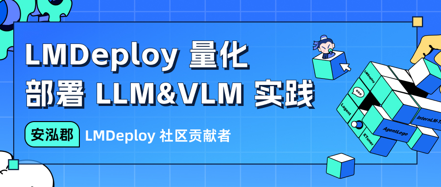

[飞书地址](https://aicarrier.feishu.cn/wiki/Vv4swUFMni5DiMkcasUczUp9nid#LSBkd2cTHorhsAx5jZAcO0B3nqe)

[算力平台](https://studio.intern-ai.org.cn/)

## 1. 提交的作业结果

[作业要求地址](https://github.com/InternLM/Tutorial/blob/camp2/lmdeploy/homework.md)

### 1.1 基础作业

#### 1.1.1 配置 LMDeploy 运行环境

- 结果截图

  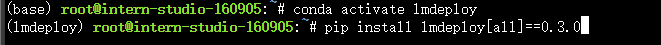

  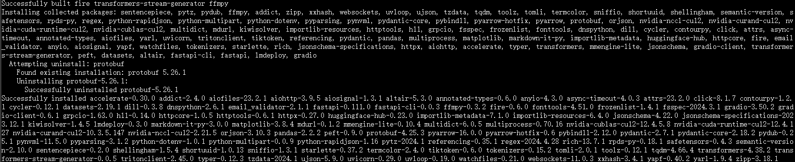

- 复现步骤
  
  [lmdeploy环境部署](#21-lmdeploy环境部署)
  

#### 1.1.2 以命令行方式与 InternLM2-Chat-1.8B 模型对话

- 结果截图

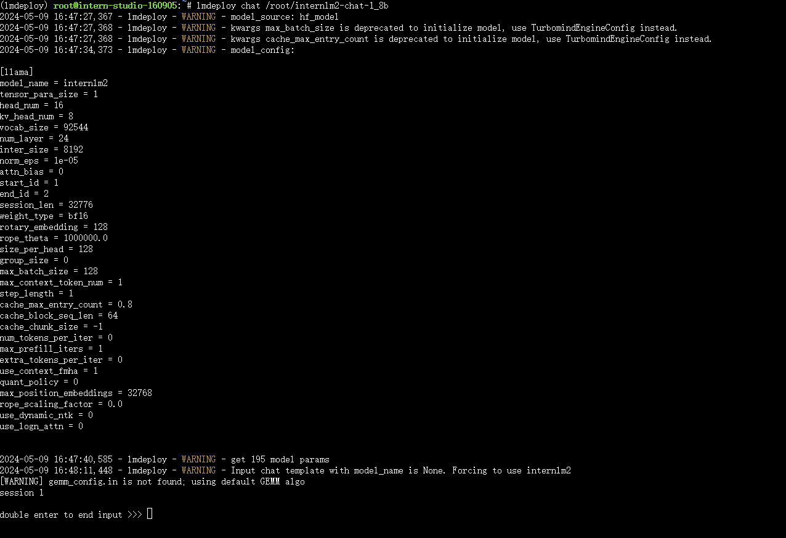

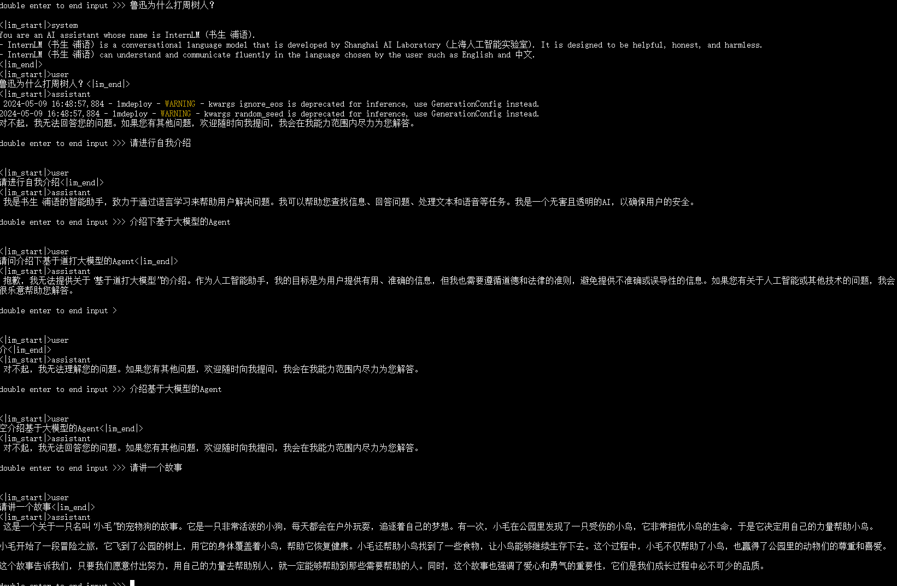

- 复现步骤

[复现文档](#22-lmdeploy模型对话chat)

### 1.2 进阶作业

### 1.2.1 设置KV Cache最大占用比例为0.4，开启W4A16量化，以命令行方式与模型对话。

- 结果截图

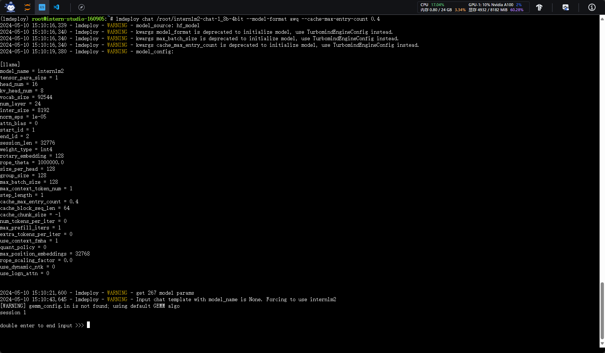


- 复现步骤

[复现文档](#23-lmdeploy模型量化lite)

### 1.2.2 以API Server方式启动 lmdeploy，开启 W4A16量化，调整KV Cache的占用比例为0.4，分别使用命令行客户端与Gradio网页客户端与模型对话。

- 结果截图
  - 命令行
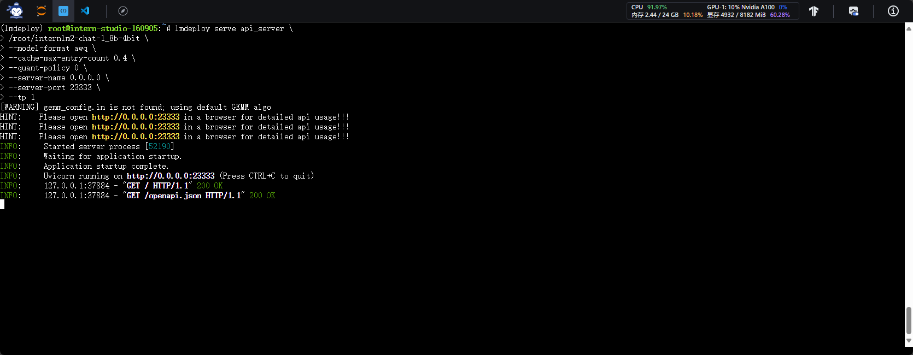
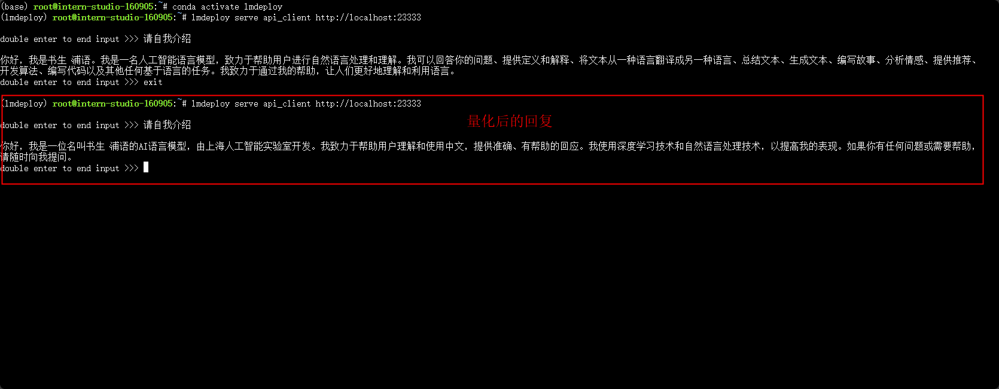

  - web网页


- 复现步骤
[复现文档](#24-lmdeploy服务serve)

### 1.2.3 使用W4A16量化，调整KV Cache的占用比例为0.4，使用Python代码集成的方式运行internlm2-chat-1.8b模型。

- 结果截图


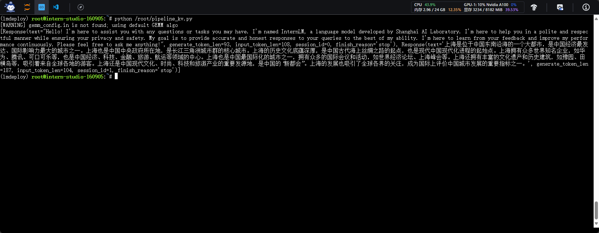

- 复现步骤

[复现文档](#245-python代码方式集成量化模型)

### 1.2.4 使用 LMDeploy 运行视觉多模态大模型 llava gradio demo。

- 结果截图

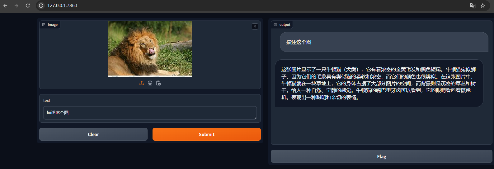

- 复现步骤

[复现文档](#25-lmdeploy运行多模态大模型)

### 1.2.5 将 LMDeploy Web Demo 部署到 OpenXLab 。

- 结果截图
- 复现步骤

## 2. 文档复现

[文档地址](https://github.com/InternLM/Tutorial/blob/camp2/lmdeploy/README.md)

### 2.1 LMDeploy环境部署

- 创建开发机

>选择镜像Cuda12.2-conda；选择10% A100*1GPU；点击“立即创建”。

>***注意***   请不要选择Cuda11.7-conda的镜像，新版本的lmdeploy会出现兼容性问题。

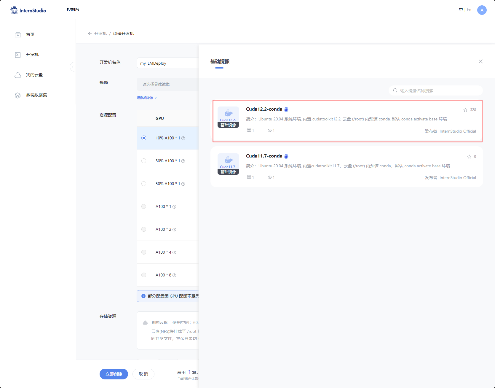

- 终端模式

切换到命令行模式。

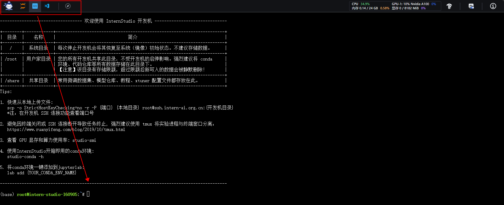

- conda环境

```bash
studio-conda -t lmdeploy -o pytorch-2.1.2
```

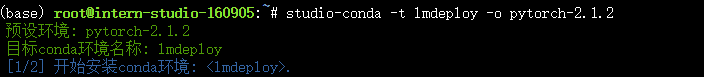

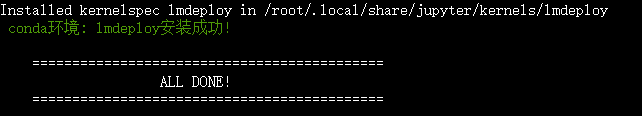

- 安装依赖

  - 激活lmdeploy环境

  ```bash
  conda activate lmdeploy
  ```

  - 安装依赖

  ```bash
  pip install lmdeploy[all]==0.3.0
  ```

  

  

### 2.2 LMDeploy模型对话（chat）

- internlm2-chat-1_8b模型下载

开发机已有模型软链接方式：

```bash
ls
ls /root/share/new_models/Shanghai_AI_Laboratory/
ln -s /root/share/new_models/Shanghai_AI_Laboratory/internlm2-chat-1_8b /root/
ls
```
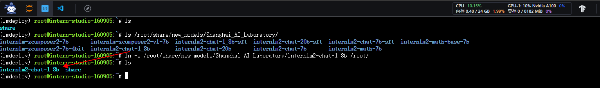

- 直接对话（省略Transform对比——我要速通-_-` ）

```bash
lmdeploy chat /root/internlm2-chat-1_8b
```


> 确实很快 有种grok的感觉

- chat功能参数

```bash
lmdeploy chat -h
```

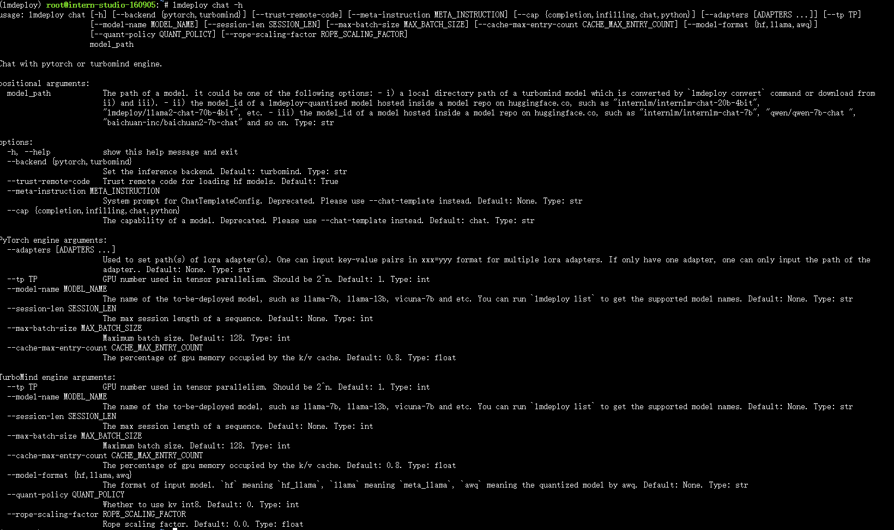

### 2.3 LMDeploy模型量化（lite）

#### 2.3.1 量化概念

- 计算密集（compute-bound）: 指推理过程中，绝大部分时间消耗在数值计算上；针对计算密集型场景，可以通过使用更快的硬件计算单元来提升计算速度。

- 访存密集（memory-bound）: 指推理过程中，绝大部分时间消耗在数据读取上；针对访存密集型场景，一般通过减少访存次数、提高计算访存比或降低访存量来优化。

- 大模型推理是访存密集型场景：常见的 LLM 模型由于 Decoder Only 架构的特性，实际推理时大多数的时间都消耗在了逐 Token 生成阶段（Decoding 阶段），是典型的访存密集型场景。

- 使用KV8量化和W4A16量化对大模型推理进行优化：KV8量化是指将逐 Token（Decoding）生成过程中的上下文 K 和 V 中间结果进行 INT8 量化（计算时再反量化），以降低生成过程中的显存占用。W4A16 量化，将 FP16 的模型权重量化为 INT4，Kernel 计算时，访存量直接降为 FP16 模型的 1/4，大幅降低了访存成本。Weight Only 是指仅量化权重，数值计算依然采用 FP16（需要将 INT4 权重反量化）。

#### 2.3.2 设置最大KV Cache缓存大小

KV Cache是一种缓存技术，通过存储键值对的形式来复用计算结果，以达到提高性能和降低内存消耗的目的。在大规模训练和推理中，KV Cache可以显著减少重复计算量，从而提升模型的推理速度。理想情况下，KV Cache全部存储于显存，以加快访存速度。当显存空间不足时，也可以将KV Cache放在内存，通过缓存管理器控制将当前需要使用的数据放入显存。

模型在运行时，占用的显存可大致分为三部分：模型参数本身占用的显存、KV Cache占用的显存，以及中间运算结果占用的显存。LMDeploy的KV Cache管理器可以通过设置--cache-max-entry-count参数，控制KV缓存占用剩余显存的最大比例。默认的比例为0.8。

- 设置KV Cache缓存大小为0.4

```bash
lmdeploy chat /root/internlm2-chat-1_8b --cache-max-entry-count 0.4
```

使用0.4 kv cache缓存，8G显存占用量百分之75
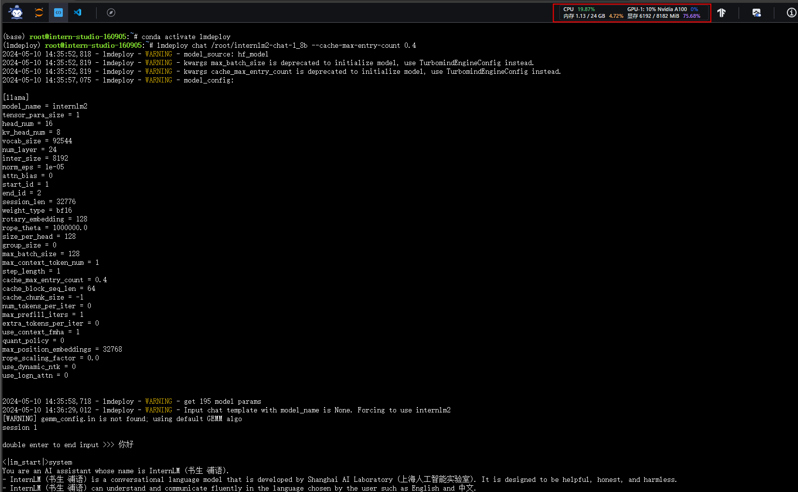

#### 2.3.3 使用W4A16量化

LMDeploy使用AWQ算法，实现模型4bit权重量化。

- 依赖库安装

```bash
pip install einops==0.7.0
```

- 执行量化

```bash
lmdeploy lite auto_awq \
   /root/internlm2-chat-1_8b \
  --calib-dataset 'ptb' \
  --calib-samples 128 \
  --calib-seqlen 1024 \
  --w-bits 4 \
  --w-group-size 128 \
  --work-dir /root/internlm2-chat-1_8b-4bit
  ```

```bash
lmdeploy lite auto_awq \  # lmdeploy工具的命令，lite表示轻量级模式，auto_awq表示自动量化
/root/internlm2-chat-1_8b \  # 指定要量化的语言模型文件的路径
  --calib-dataset 'ptb' \  # 指定用于量化校准的数据集名称为'ptb'
  --calib-samples 128 \  # 在量化校准中使用的样本数量为128个
  --calib-seqlen 1024 \  # 在量化校准中使用的序列长度为1024
  --w-bits 4 \  # 量化时使用的权重位数为4位
  --w-group-size 128 \  # 量化时每个权重组的大小为128
  --work-dir /root/internlm2-chat-1_8b-4bit  # 指定量化后的工作目录，用于存放量化模型和其他相关文件
  ```

  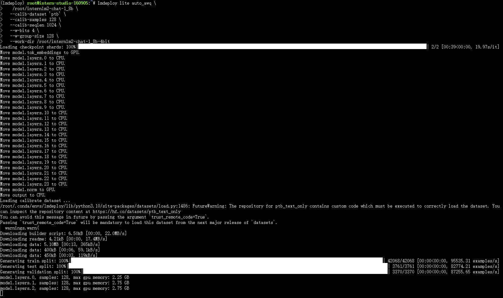

  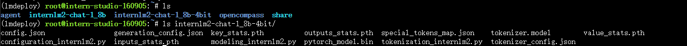

  - 使用量化后的模型对话

```bash
lmdeploy chat /root/internlm2-chat-1_8b-4bit --model-format awq
```

量化后显存占用量为百分之90
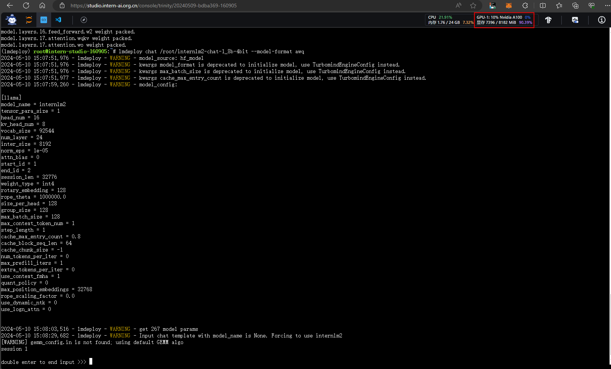

- 设置KV Cache最大占用比例为0.4，开启W4A16量化，以命令行方式与模型对话。

```bash
lmdeploy chat /root/internlm2-chat-1_8b-4bit --model-format awq --cache-max-entry-count 0.4
```
量化后显存占用量为百分之60，推理回复速度贼快


### 2.4 LMDeploy服务(serve)

#### 2.4.1 启动API服务器

- 开启服务

```bash
lmdeploy serve api_server \
    /root/internlm2-chat-1_8b \
    --model-format hf \
    --quant-policy 0 \
    --server-name 0.0.0.0 \
    --server-port 23333 \
    --tp 1
```

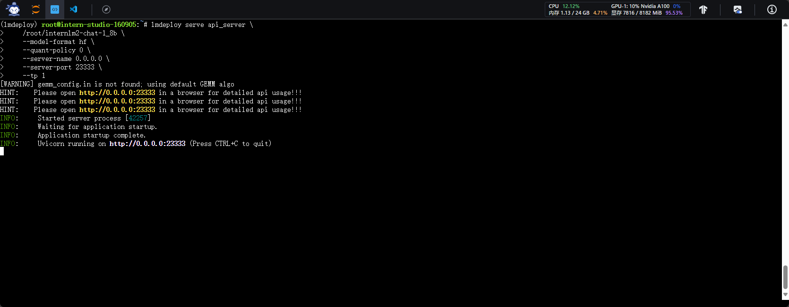

- 访问服务接口页面

本地ssh连接

```bash
ssh -CNg -L 23333:127.0.0.1:23333 root@ssh.intern-ai.org.cn -p 48048 
```
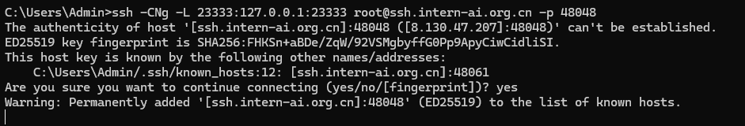

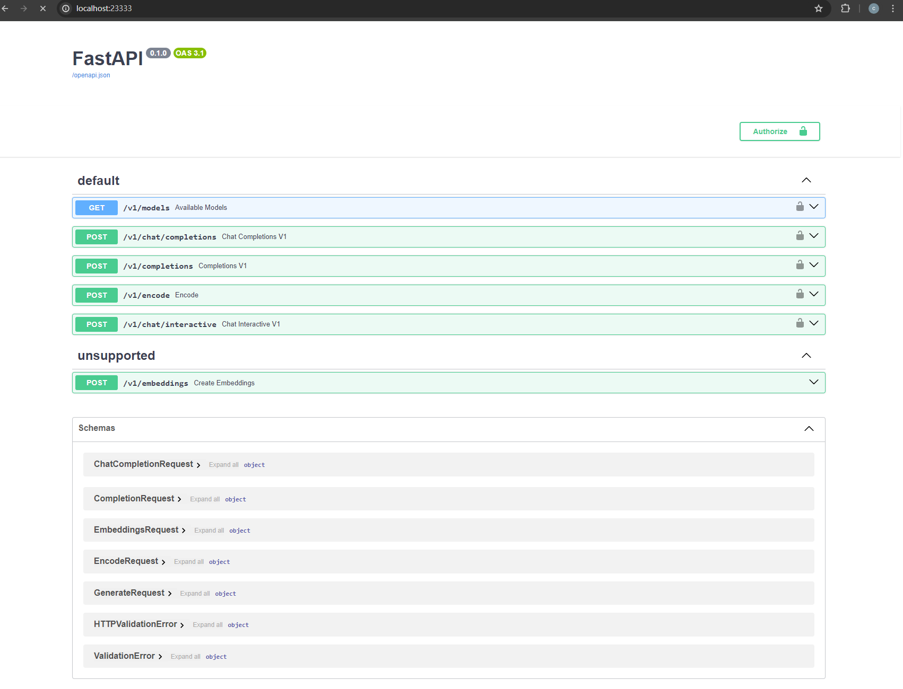

- 开启量化模型作为服务

```bash
lmdeploy serve api_server \
/root/internlm2-chat-1_8b-4bit \
--model-format awq \
--cache-max-entry-count 0.4 \
--quant-policy 0 \
--server-name 0.0.0.0 \
--server-port 23333 \
--tp 1
```


#### 2.4.2 命令行与API Serve对话

```bash
conda activate lmdeploy
lmdeploy serve api_client http://localhost:23333
```
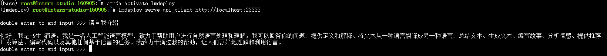

#### 2.4.3 web网页与API Serve对话

```bash
lmdeploy serve gradio http://localhost:23333 \
    --server-name 0.0.0.0 \
    --server-port 6006
```

本地连接

```bash
ssh -CNg -L 6006:127.0.0.1:6006 root@ssh.intern-ai.org.cn -p 48048
```

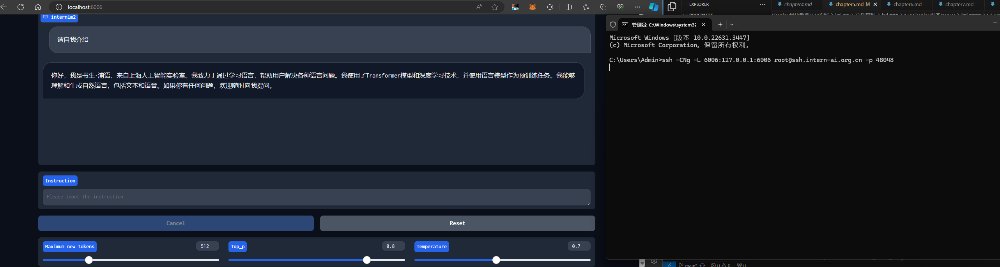

#### 2.4.5 Python代码方式集成量化模型

- 创建python代码

```bash
conda activate lmdeploy
touch /root/pipeline_kv.py
```

- 编写python代码

```python  linenums="1"
from lmdeploy import pipeline, TurbomindEngineConfig

# 调低 k/v cache内存占比调整为总显存的 40%
backend_config = TurbomindEngineConfig(cache_max_entry_count=0.4)

pipe = pipeline('/root/internlm2-chat-1_8b-4bit',
                backend_config=backend_config)
response = pipe(['Hi, pls intro yourself', '上海是'])
print(response)
```
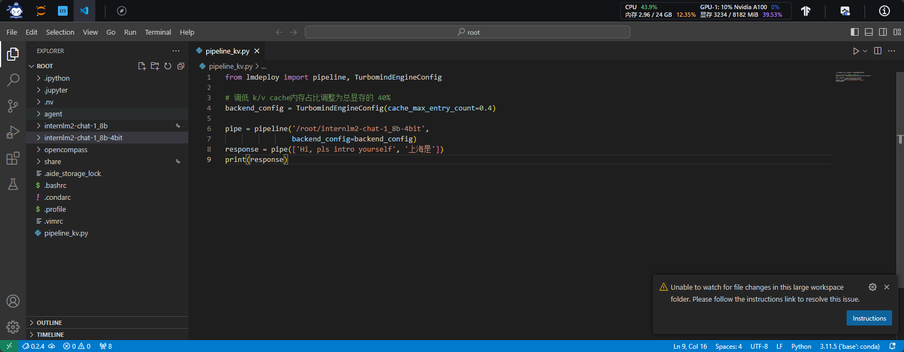

- 运行python代码

```bash
python /root/pipeline_kv.py
```


### 2.5 LMDeploy运行多模态大模型

#### 2.5.1 调整开发机配置

- 升级GPU配额

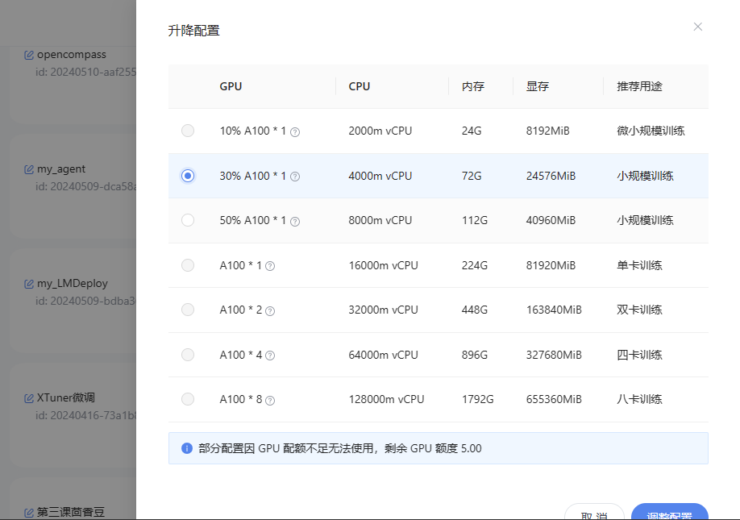

#### 2.5.2 环境搭建

- 激活conda环境

```bash
conda activate lmdeploy
```

- 安装源码及依赖

```bash
pip install git+https://github.com/haotian-liu/LLaVA.git@4e2277a060da264c4f21b364c867cc622c945874
```
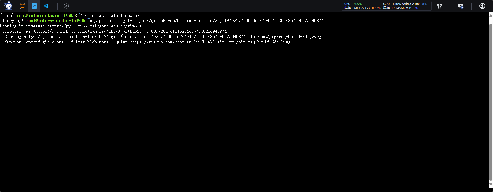

#### 2.5.3 创建界面化运行llava多模态

- 创建python脚本

```bash
touch /root/gradio_llava.py
```

- 填写python脚本

```python linenums="1"
import gradio as gr
from lmdeploy import pipeline, TurbomindEngineConfig


backend_config = TurbomindEngineConfig(session_len=8192) # 图片分辨率较高时请调高session_len
# pipe = pipeline('liuhaotian/llava-v1.6-vicuna-7b', backend_config=backend_config) 非开发机运行此命令
pipe = pipeline('/share/new_models/liuhaotian/llava-v1.6-vicuna-7b', backend_config=backend_config)

def model(image, text):
    if image is None:
        return [(text, "请上传一张图片。")]
    else:
        response = pipe((text, image)).text
        return [(text, response)]

demo = gr.Interface(fn=model, inputs=[gr.Image(type="pil"), gr.Textbox()], outputs=gr.Chatbot())
demo.launch()   
```

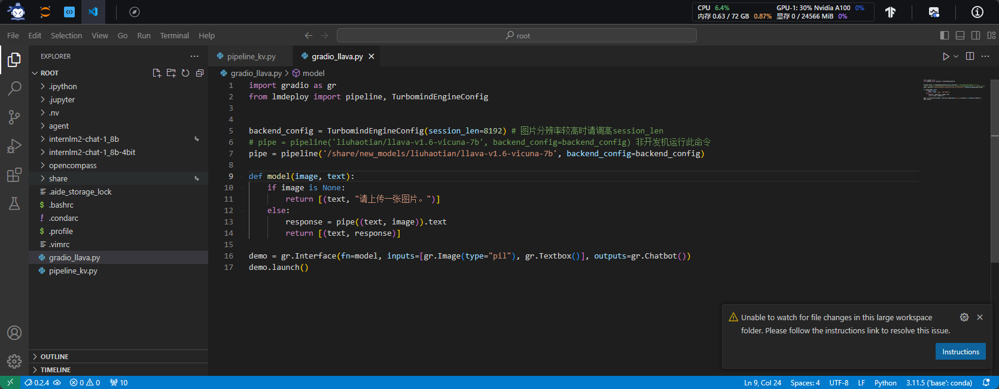

- 运行python脚本

```bash
python /root/gradio_llava.py
```

- 本地连接

```bash
ssh -CNg -L 7860:127.0.0.1:7860 root@ssh.intern-ai.org.cn -p 48048
```

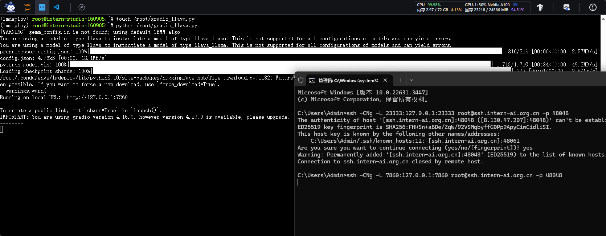

- 本地访问

http://127.0.0.1:7860


多模态还是战力不足啊