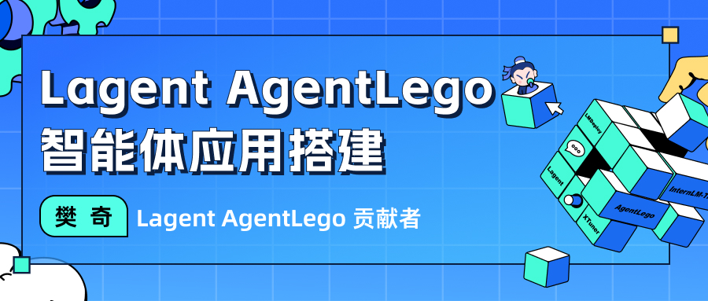
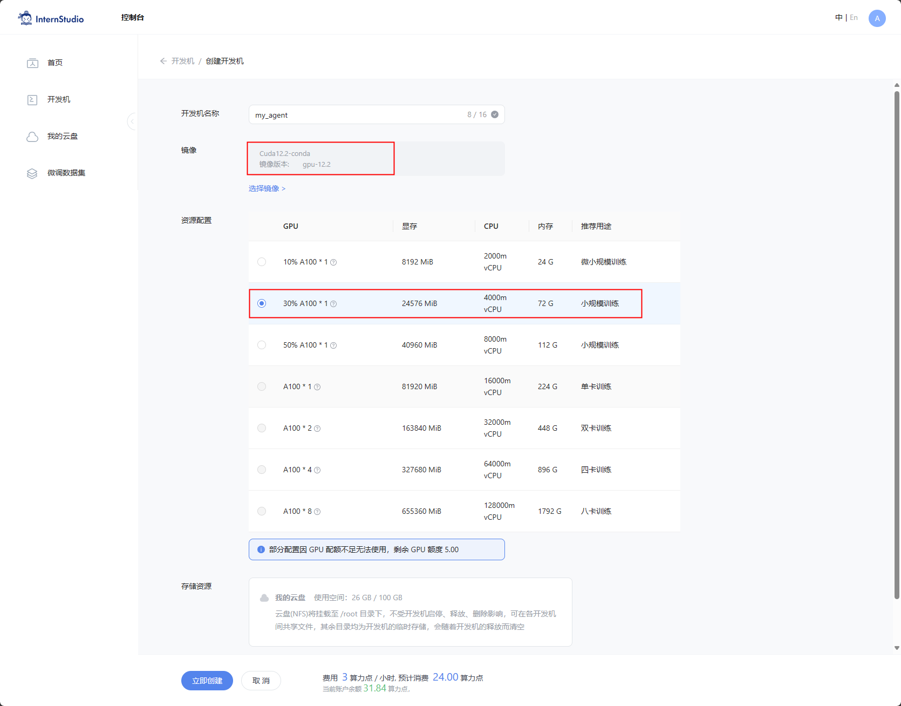
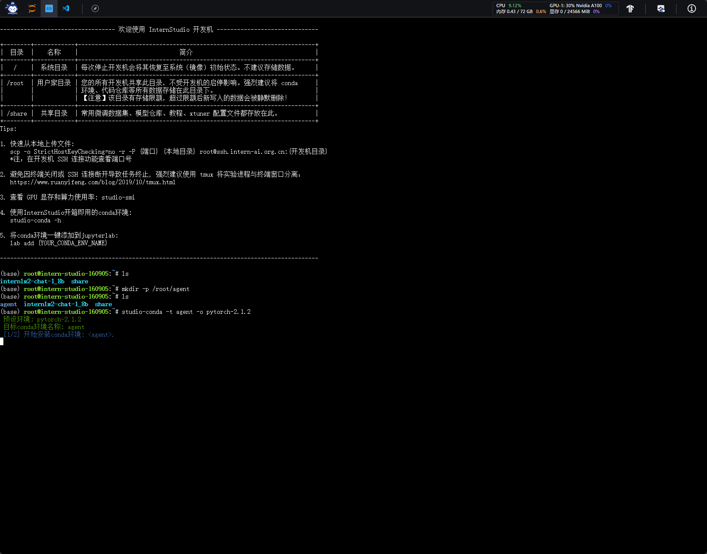

# 第六课 Lagent & AgentLego 智能体应用搭建



[飞书地址](https://aicarrier.feishu.cn/wiki/Vv4swUFMni5DiMkcasUczUp9nid#LSBkd2cTHorhsAx5jZAcO0B3nqe)

[算力平台](https://studio.intern-ai.org.cn/)

## 1. 提交的作业结果

[作业要求地址](https://github.com/InternLM/Tutorial/blob/camp2/agent/homework.md)

### 1.1 基础作业

#### 1.1.1 完成 Lagent Web Demo 使用，并在作业中上传截图。

- 结果截图
- 复现步骤

#### 1.1.2 完成 AgentLego 直接使用部分，并在作业中上传截图。

- 结果截图
- 复现步骤

### 1.2 进阶作业

#### 1.2.1 完成 AgentLego WebUI 使用，并在作业中上传截图。

- 结果截图
- 复现步骤

#### 1.2.2 使用 Lagent 或 AgentLego 实现自定义工具并完成调用，并在作业中上传截图。

- 结果截图
- 复现步骤

## 2. 文档复现

[文档地址](https://github.com/InternLM/Tutorial/blob/camp2/agent/README.md)

### 2.1 开发环境设置

- 创建开发机

在创建开发机界面选择镜像为 Cuda12.2-conda，并选择 GPU 为30% A100。



- 配置环境

同时满足 Lagent 和 AgentLego 运行时所需依赖。

```bash
#创建一个用于存放 Agent 相关文件的目录
mkdir -p /root/agent
studio-conda -t agent -o pytorch-2.1.2
```



- 安装 Lagent 和 AgentLego

```bash
cd /root/agent
conda activate agent
git clone https://gitee.com/internlm/lagent.git
cd lagent && git checkout 581d9fb && pip install -e . && cd ..
git clone https://gitee.com/internlm/agentlego.git
cd agentlego && git checkout 7769e0d && pip install -e . && cd ..
```

- 安装依赖

```bash
conda activate agent
pip install lmdeploy==0.3.0
```

- 获取案例源码

```bash
cd /root/agent
git clone -b camp2 https://gitee.com/internlm/Tutorial.git
```

### 2.2 Lagent Web Demo

[文档地址](https://github.com/InternLM/Tutorial/blob/camp2/agent/lagent.md#1-lagent-web-demo)

#### 2.2.1 部署

- 启动api_server

```bash
conda activate agent

lmdeploy serve api_server /root/share/new_models/Shanghai_AI_Laboratory/internlm2-chat-7b  --server-name 127.0.0.1  --model-name nternlm2-chat-7b   --cache-max-entry-count 0.1
```
