# 第六课 Lagent & AgentLego 智能体应用搭建


[飞书地址](https://aicarrier.feishu.cn/wiki/Vv4swUFMni5DiMkcasUczUp9nid#LSBkd2cTHorhsAx5jZAcO0B3nqe)

[算力平台](https://studio.intern-ai.org.cn/)

## 1. 提交的作业结果

[作业要求地址](https://github.com/InternLM/Tutorial/blob/camp2/agent/homework.md)

### 1.1 基础作业

#### 1.1.1 完成 Lagent Web Demo 使用，并在作业中上传截图。

- 结果截图

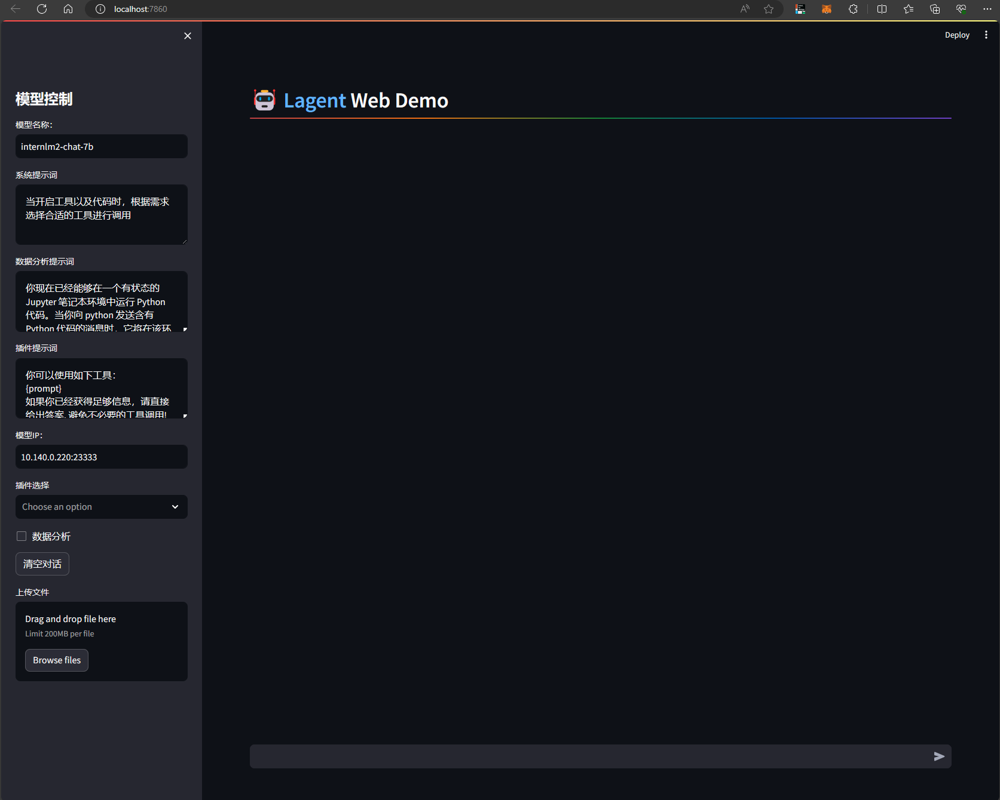

- 复现步骤

[复现笔记](#22-lagent-web-demo)

#### 1.1.2 完成 AgentLego 直接使用部分，并在作业中上传截图。

- 结果截图

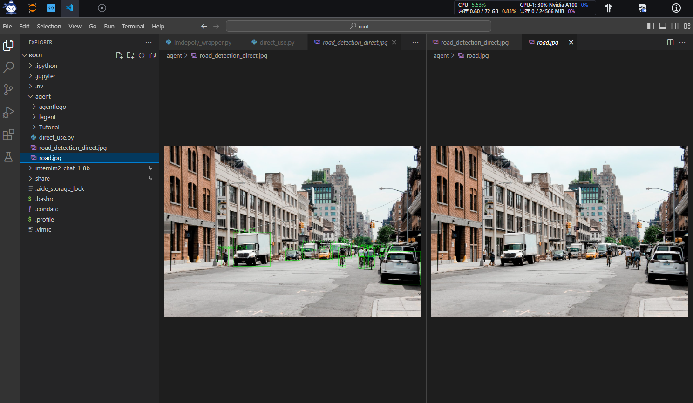

- 复现步骤

[复现笔记](#23-直接使用-agentlego)


### 1.2 进阶作业

#### 1.2.1 完成 AgentLego WebUI 使用，并在作业中上传截图。

- 结果截图
- 复现步骤

#### 1.2.2 使用 Lagent 或 AgentLego 实现自定义工具并完成调用，并在作业中上传截图。

- 结果截图
- 复现步骤

## 2. 文档复现

[文档地址](https://github.com/InternLM/Tutorial/blob/camp2/agent/README.md)

### 2.1 开发环境设置

- 创建开发机

在创建开发机界面选择镜像为 Cuda12.2-conda，并选择 GPU 为30% A100。


- 配置环境

同时满足 Lagent 和 AgentLego 运行时所需依赖。

```bash
#创建一个用于存放 Agent 相关文件的目录
mkdir -p /root/agent
studio-conda -t agent -o pytorch-2.1.2
```


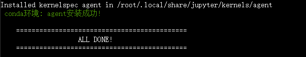

- 安装 Lagent 和 AgentLego

```bash
cd /root/agent
conda activate agent
git clone https://gitee.com/internlm/lagent.git
cd lagent && git checkout 581d9fb && pip install -e . && cd ..
git clone https://gitee.com/internlm/agentlego.git
cd agentlego && git checkout 7769e0d && pip install -e . && cd ..
```

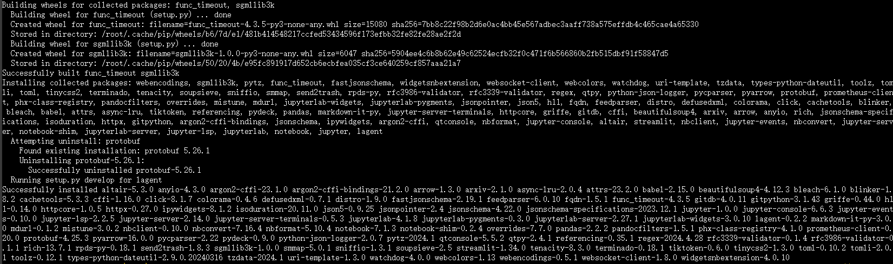

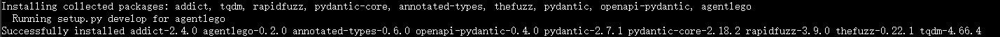


- 安装依赖

```bash
conda activate agent
pip install lmdeploy==0.3.0
```

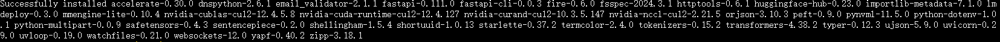

- 获取案例源码

```bash
cd /root/agent
git clone -b camp2 https://gitee.com/internlm/Tutorial.git
```

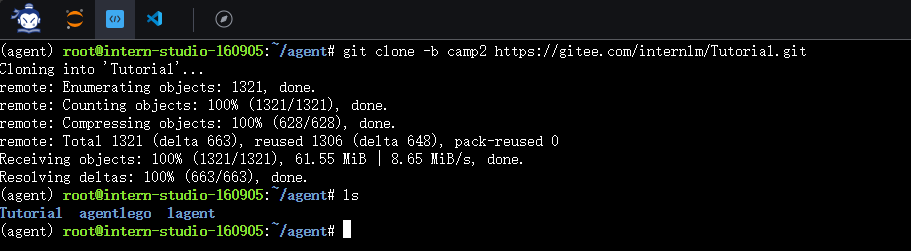

### 2.2 Lagent Web Demo

[文档地址](https://github.com/InternLM/Tutorial/blob/camp2/agent/lagent.md#1-lagent-web-demo)

#### 2.2.1 部署服务

- 启动api_server

```bash
conda activate agent

lmdeploy serve api_server /root/share/new_models/Shanghai_AI_Laboratory/internlm2-chat-7b  --server-name 127.0.0.1  --model-name nternlm2-chat-7b   --cache-max-entry-count 0.1
```

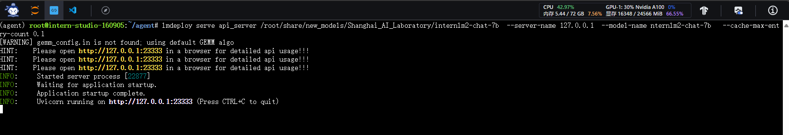

#### 2.2.2 启动web案例

```bash
conda activate agent
cd /root/agent/lagent/examples
streamlit run internlm2_agent_web_demo.py --server.address 127.0.0.1 --server.port 7860
```
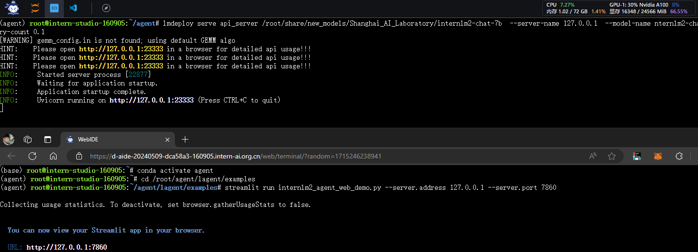

#### 2.2.3 本地访问

- 本地打开cmd命令行 

```bash
ssh -CNg -L 7860:127.0.0.1:7860 -L 23333:127.0.0.1:23333 root@ssh.intern-ai.org.cn -p 48061
```

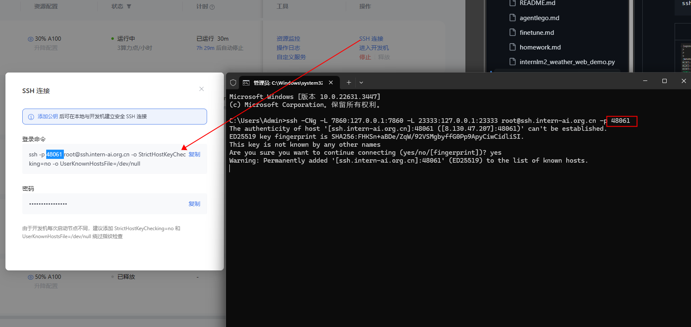

- 本地访问链接

```bash
http://localhost:7860/
```


- 暂时报错

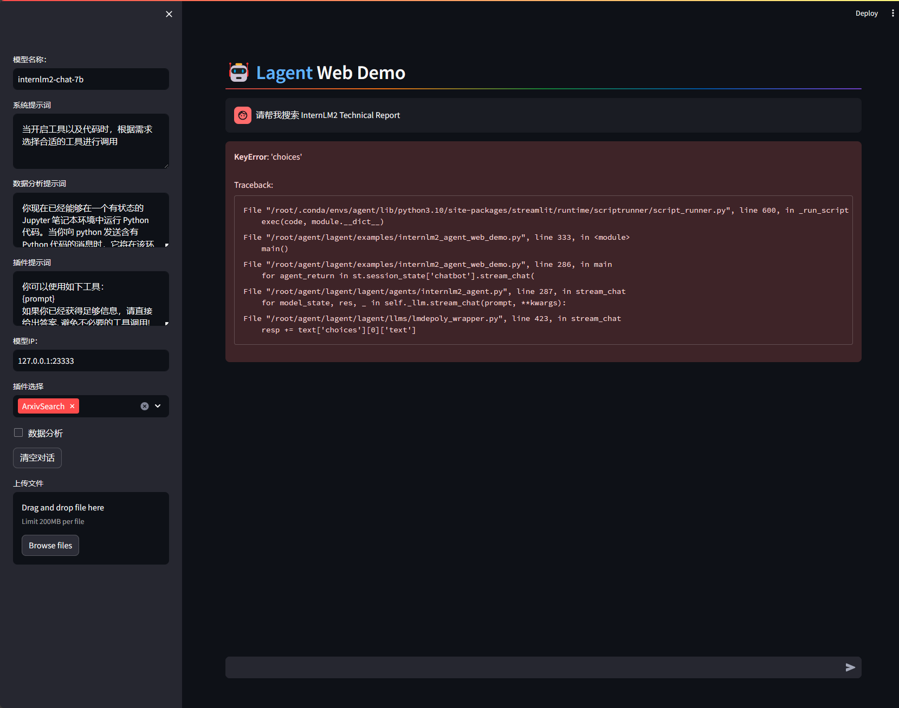

### 2.3 直接使用 AgentLego

#### 2.3.1 文件获取

- 获取图片

```bash
cd /root/agent
wget http://download.openmmlab.com/agentlego/road.jpg
```

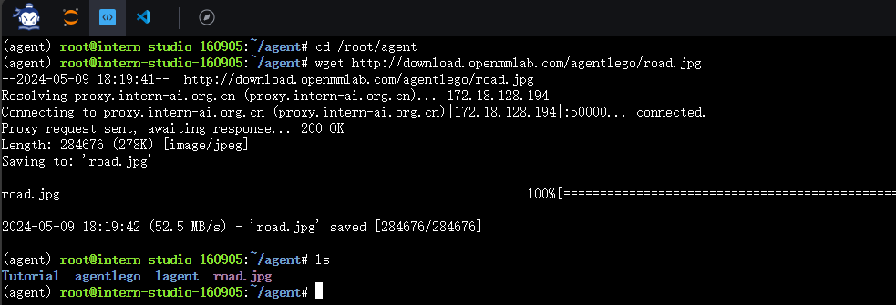

#### 2.3.2 环境依赖

AgentLego 所实现的目标检测工具是基于 mmdet (MMDetection) 算法库中的 RTMDet-Large 模型，因此我们首先安装 mim，然后通过 mim 工具来安装 mmdet。

```bash
conda activate agent
pip install openmim==0.3.9
mim install mmdet==3.3.0
```

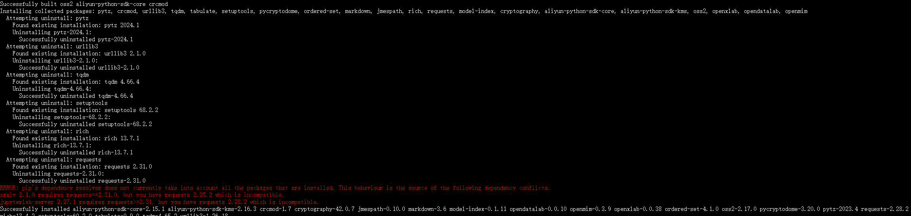


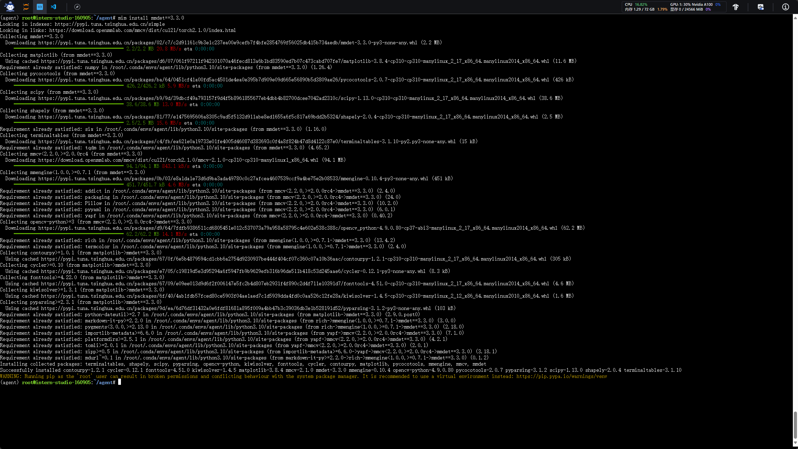

#### 2.3.3 代码检测

- 创建代码

  通过 touch /root/agent/direct_use.py（大小写敏感）的方式在 /root/agent 目录下新建 direct_use.py 以直接使用目标检测工具。
```bash
touch /root/agent/direct_use.py
```

- 编写代码

  direct_use.py 的代码如下：

```python  linenums="1"
  import re

import cv2
from agentlego.apis import load_tool

# load tool
tool = load_tool('ObjectDetection', device='cuda')

# apply tool
visualization = tool('/root/agent/road.jpg')
print(visualization)

# visualize
image = cv2.imread('/root/agent/road.jpg')

preds = visualization.split('\n')
pattern = r'(\w+) \((\d+), (\d+), (\d+), (\d+)\), score (\d+)'

for pred in preds:
    name, x1, y1, x2, y2, score = re.match(pattern, pred).groups()
    x1, y1, x2, y2, score = int(x1), int(y1), int(x2), int(y2), int(score)
    cv2.rectangle(image, (x1, y1), (x2, y2), (0, 255, 0), 1)
    cv2.putText(image, f'{name} {score}', (x1, y1), cv2.FONT_HERSHEY_SIMPLEX, 0.8, (0, 255, 0), 1)

cv2.imwrite('/root/agent/road_detection_direct.jpg', image)
```

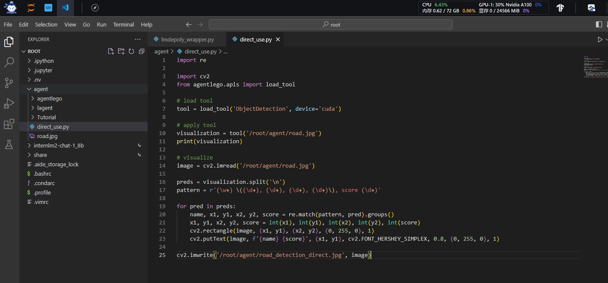

- 执行代码

```bash 
python /root/agent/direct_use.py
```

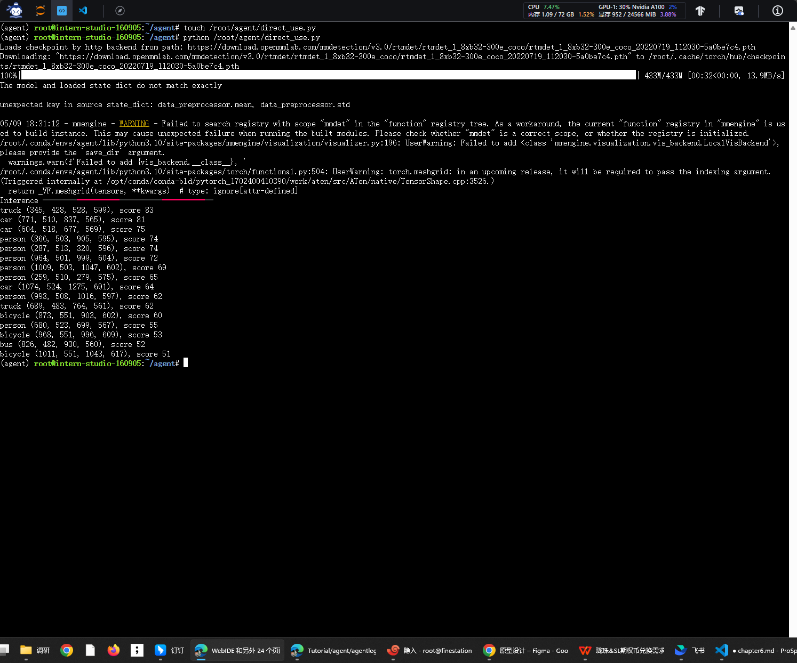


- 执行结果

/root/agent 名为 road_detection_direct.jpg 的图片

