# 课时六 Lagent & AgentLego 智能体应用搭建


[飞书地址](https://aicarrier.feishu.cn/wiki/Vv4swUFMni5DiMkcasUczUp9nid#LSBkd2cTHorhsAx5jZAcO0B3nqe)

[算力平台](https://studio.intern-ai.org.cn/)

## 1. 提交的作业结果

[作业要求地址](https://github.com/InternLM/Tutorial/blob/camp2/agent/homework.md)

### 1.1 基础作业

#### 1.1.1 完成 Lagent Web Demo 使用，并在作业中上传截图。

- 结果截图


- 复现步骤

[复现笔记](#22-lagent-web-demo)

#### 1.1.2 完成 AgentLego 直接使用部分，并在作业中上传截图。

- 结果截图


- 复现步骤

[复现笔记](#23-直接使用-agentlego)


### 1.2 进阶作业

#### 1.2.1 完成 AgentLego WebUI 使用，并在作业中上传截图。

- 结果截图

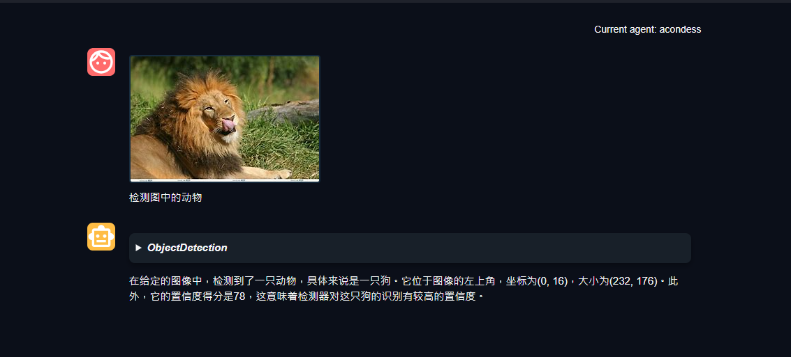

- 复现步骤

[复现文档](#24-agentlego-webui)

#### 1.2.2 使用 Lagent 或 AgentLego 实现自定义工具并完成调用，并在作业中上传截图。

- 结果截图

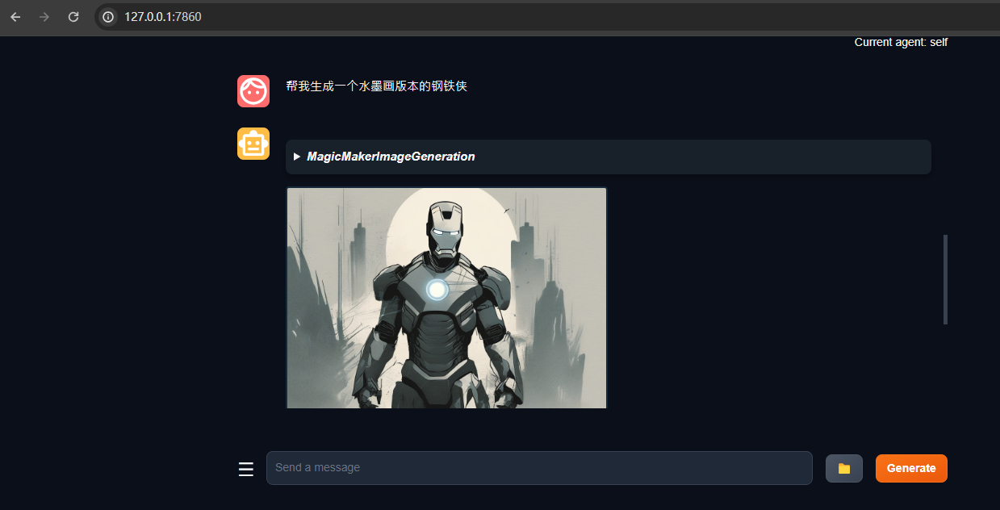

- 复现步骤

[复现文档](#25-agentlego-自定义工具)

## 2. 文档复现

[文档地址](https://github.com/InternLM/Tutorial/blob/camp2/agent/README.md)

### 2.1 开发环境设置

- 创建开发机

在创建开发机界面选择镜像为 Cuda12.2-conda，并选择 GPU 为30% A100。


- 配置环境

同时满足 Lagent 和 AgentLego 运行时所需依赖。

```bash
#创建一个用于存放 Agent 相关文件的目录
mkdir -p /root/agent
studio-conda -t agent -o pytorch-2.1.2
```


- 安装 Lagent 和 AgentLego

```bash
cd /root/agent
conda activate agent
git clone https://gitee.com/internlm/lagent.git
cd lagent && git checkout 581d9fb && pip install -e . && cd ..
git clone https://gitee.com/internlm/agentlego.git
cd agentlego && git checkout 7769e0d && pip install -e . && cd ..
```


- 安装依赖

```bash
conda activate agent
pip install lmdeploy==0.3.0
```


- 获取案例源码

```bash
cd /root/agent
git clone -b camp2 https://gitee.com/internlm/Tutorial.git
```


### 2.2 Lagent Web Demo

[文档地址](https://github.com/InternLM/Tutorial/blob/camp2/agent/lagent.md#1-lagent-web-demo)

#### 2.2.1 部署服务

- 启动api_server

```bash
conda activate agent

lmdeploy serve api_server /root/share/new_models/Shanghai_AI_Laboratory/internlm2-chat-7b  --server-name 127.0.0.1  --model-name nternlm2-chat-7b   --cache-max-entry-count 0.1
```


#### 2.2.2 启动web案例

```bash
conda activate agent
cd /root/agent/lagent/examples
streamlit run internlm2_agent_web_demo.py --server.address 127.0.0.1 --server.port 7860
```


#### 2.2.3 本地访问

- 本地打开cmd命令行 

```bash
ssh -CNg -L 7860:127.0.0.1:7860 -L 23333:127.0.0.1:23333 root@ssh.intern-ai.org.cn -p 48061
```


- 本地访问链接

```bash
http://localhost:7860/
```


- 暂时报错


### 2.3 直接使用 AgentLego

#### 2.3.1 文件获取

- 获取图片

```bash
cd /root/agent
wget http://download.openmmlab.com/agentlego/road.jpg
```


#### 2.3.2 环境依赖

AgentLego 所实现的目标检测工具是基于 mmdet (MMDetection) 算法库中的 RTMDet-Large 模型，因此我们首先安装 mim，然后通过 mim 工具来安装 mmdet。

```bash
conda activate agent
pip install openmim==0.3.9
mim install mmdet==3.3.0
```


#### 2.3.3 代码检测

- 创建代码

  通过 touch /root/agent/direct_use.py（大小写敏感）的方式在 /root/agent 目录下新建 direct_use.py 以直接使用目标检测工具。
```bash
touch /root/agent/direct_use.py
```

- 编写代码

  direct_use.py 的代码如下：

```python  linenums="1"
  import re

import cv2
from agentlego.apis import load_tool

# load tool
tool = load_tool('ObjectDetection', device='cuda')

# apply tool
visualization = tool('/root/agent/road.jpg')
print(visualization)

# visualize
image = cv2.imread('/root/agent/road.jpg')

preds = visualization.split('\n')
pattern = r'(\w+) \((\d+), (\d+), (\d+), (\d+)\), score (\d+)'

for pred in preds:
    name, x1, y1, x2, y2, score = re.match(pattern, pred).groups()
    x1, y1, x2, y2, score = int(x1), int(y1), int(x2), int(y2), int(score)
    cv2.rectangle(image, (x1, y1), (x2, y2), (0, 255, 0), 1)
    cv2.putText(image, f'{name} {score}', (x1, y1), cv2.FONT_HERSHEY_SIMPLEX, 0.8, (0, 255, 0), 1)

cv2.imwrite('/root/agent/road_detection_direct.jpg', image)
```


- 执行代码

```bash 
python /root/agent/direct_use.py
```


- 执行结果

/root/agent 名为 road_detection_direct.jpg 的图片


### 2.4 AgentLego WebUI

[文档地址](https://github.com/InternLM/Tutorial/blob/camp2/agent/agentlego.md#2-%E4%BD%9C%E4%B8%BA%E6%99%BA%E8%83%BD%E4%BD%93%E5%B7%A5%E5%85%B7%E4%BD%BF%E7%94%A8)

#### 2.4.1 修改模型调用脚本

修改 /root/agent/agentlego/webui/modules/agents/lagent_agent.py 文件的第 105行位置，将 internlm2-chat-20b 修改为 internlm2-chat-7b

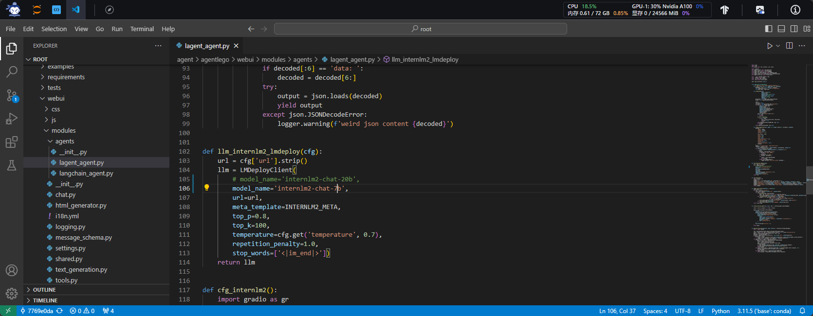

#### 2.4.2 LMDeploy部署服务

使用 LMDeploy 启动一个 api_server。

```bash
conda activate agent
lmdeploy serve api_server /root/share/new_models/Shanghai_AI_Laboratory/internlm2-chat-7b \
                            --server-name 127.0.0.1 \
                            --model-name internlm2-chat-7b \
                            --cache-max-entry-count 0.1
```
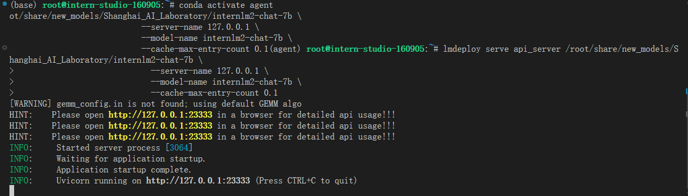

#### 2.4.3 启动 AgentLego WebUI

新建一个 terminal 以启动 AgentLego WebUI

```bash
conda activate agent
cd /root/agent/agentlego/webui
python one_click.py
```

- 本地连接

```bash
ssh -CNg -L 7860:127.0.0.1:7860 -L 23333:127.0.0.1:23333 root@ssh.intern-ai.org.cn -p 48061 
```

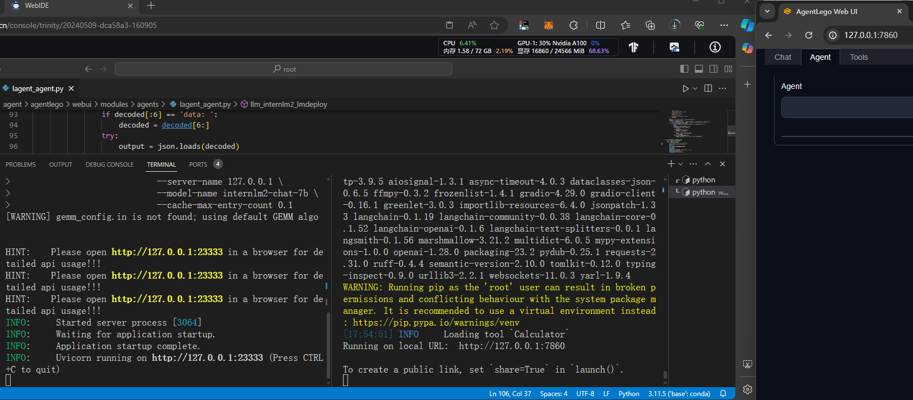

#### 2.4.4 使用 AgentLego WebUI

- 选择Agent Tag页

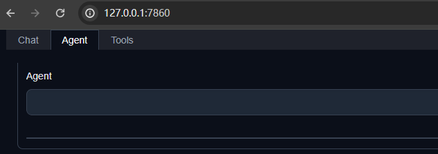

- 下拉选择New Agent

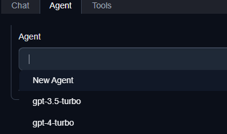

- 选择 Agent Class 为 lagent.InternLM2Agent

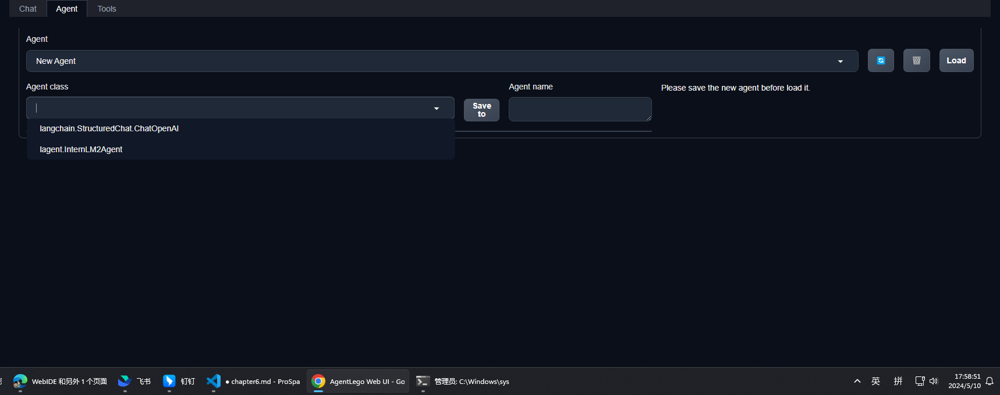

- 输入 Agent name，自定义即可，图中输入了acondess

- 点击 save to 以保存配置，这样在下次使用时只需在第2步时选择 Agent 为 internlm2 后点击 load 以加载就可以了。

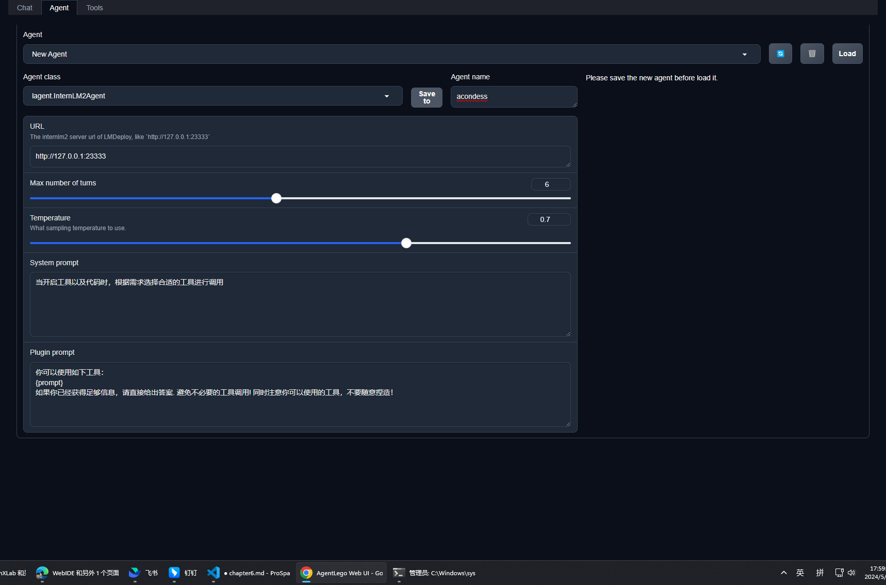

- 点击Load 加载Agent

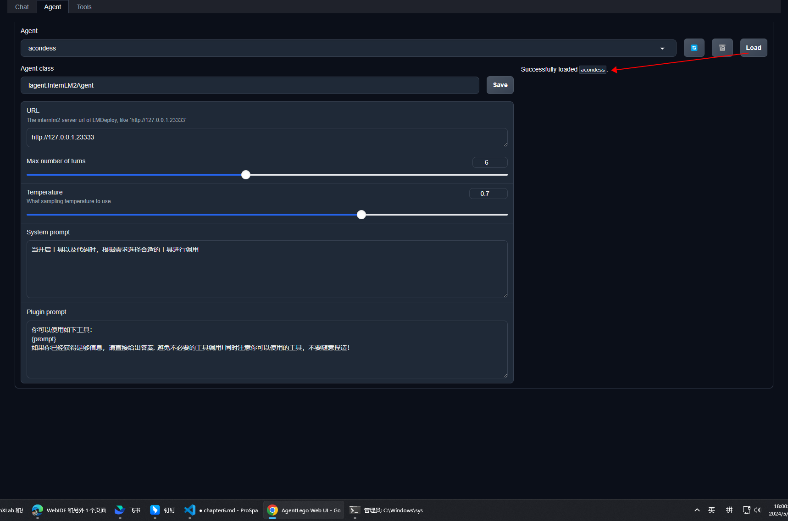

- 配置工具

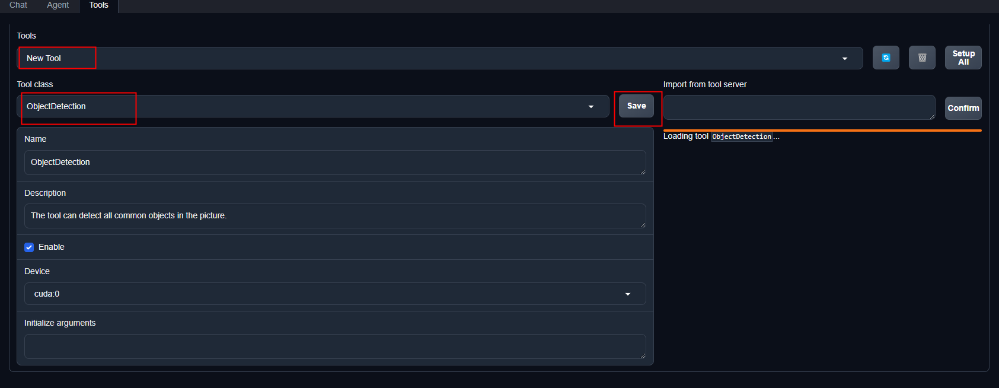

- 加载完成

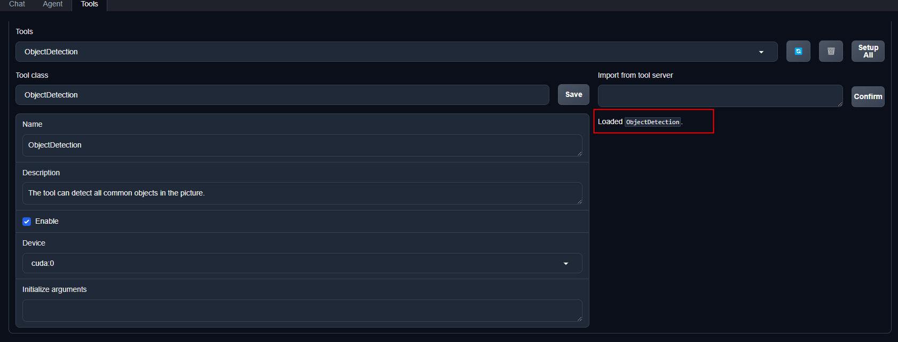

- 对话

等待工具加载完成后，点击上方 Chat 以进入对话页面。在页面下方选择工具部分只选择 ObjectDetection 工具，如下图所示。为了确保调用工具的成功率，请在使用时确保仅有这一个工具启用。

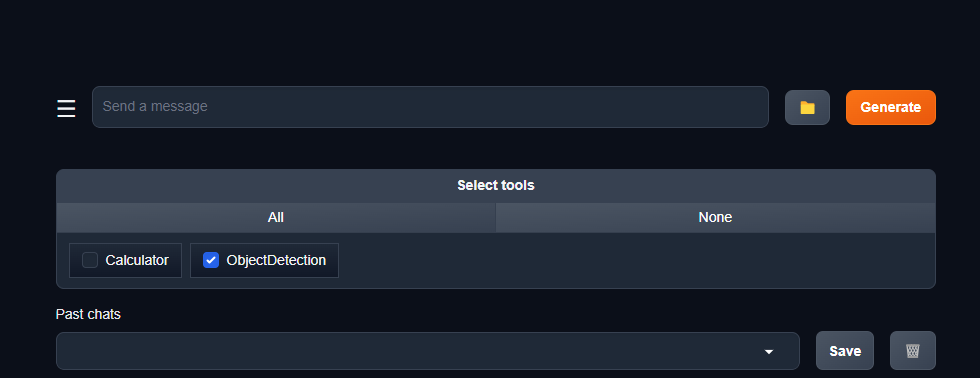

- 上传图片，输入检测要求


### 2.5 AgentLego 自定义工具

实现一个调用 MagicMaker 的 API 以实现图像生成的工具,提供图像生成、图像编辑和视频生成。

[MagicMaker地址](https://magicmaker.openxlab.org.cn/home)

#### 2.5.1 创建工具文件

- 新建python脚本

```bash
touch /root/agent/agentlego/agentlego/tools/magicmaker_image_generation.py
```

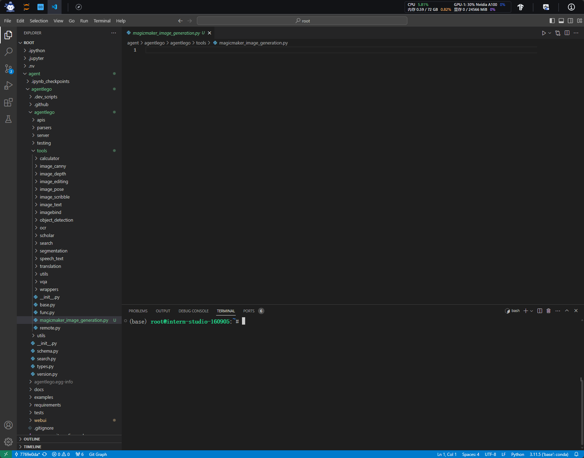

- 编写python脚本

```python linenums="1"
import json
import requests

import numpy as np

from agentlego.types import Annotated, ImageIO, Info
from agentlego.utils import require
from .base import BaseTool


class MagicMakerImageGeneration(BaseTool):

    default_desc = ('This tool can call the api of magicmaker to '
                    'generate an image according to the given keywords.')

    styles_option = [
        'dongman',  # 动漫
        'guofeng',  # 国风
        'xieshi',   # 写实
        'youhua',   # 油画
        'manghe',   # 盲盒
    ]
    aspect_ratio_options = [
        '16:9', '4:3', '3:2', '1:1',
        '2:3', '3:4', '9:16'
    ]

    @require('opencv-python')
    def __init__(self,
                 style='guofeng',
                 aspect_ratio='4:3'):
        super().__init__()
        if style in self.styles_option:
            self.style = style
        else:
            raise ValueError(f'The style must be one of {self.styles_option}')
        
        if aspect_ratio in self.aspect_ratio_options:
            self.aspect_ratio = aspect_ratio
        else:
            raise ValueError(f'The aspect ratio must be one of {aspect_ratio}')

    def apply(self,
              keywords: Annotated[str,
                                  Info('A series of Chinese keywords separated by comma.')]
        ) -> ImageIO:
        import cv2
        response = requests.post(
            url='https://magicmaker.openxlab.org.cn/gw/edit-anything/api/v1/bff/sd/generate',
            data=json.dumps({
                "official": True,
                "prompt": keywords,
                "style": self.style,
                "poseT": False,
                "aspectRatio": self.aspect_ratio
            }),
            headers={'content-type': 'application/json'}
        )
        image_url = response.json()['data']['imgUrl']
        image_response = requests.get(image_url)
        image = cv2.cvtColor(cv2.imdecode(np.frombuffer(image_response.content, np.uint8), cv2.IMREAD_COLOR),cv2.COLOR_BGR2RGB)
        return ImageIO(image)
```

#### 2.5.2 注册新工具

修改 /root/agent/agentlego/agentlego/tools/__init__.py 文件，将我们的工具注册在工具列表中。

将 MagicMakerImageGeneration 通过 from .magicmaker_image_generation import MagicMakerImageGeneration 导入到了文件中，并且将其加入了 __all__ 列表中。

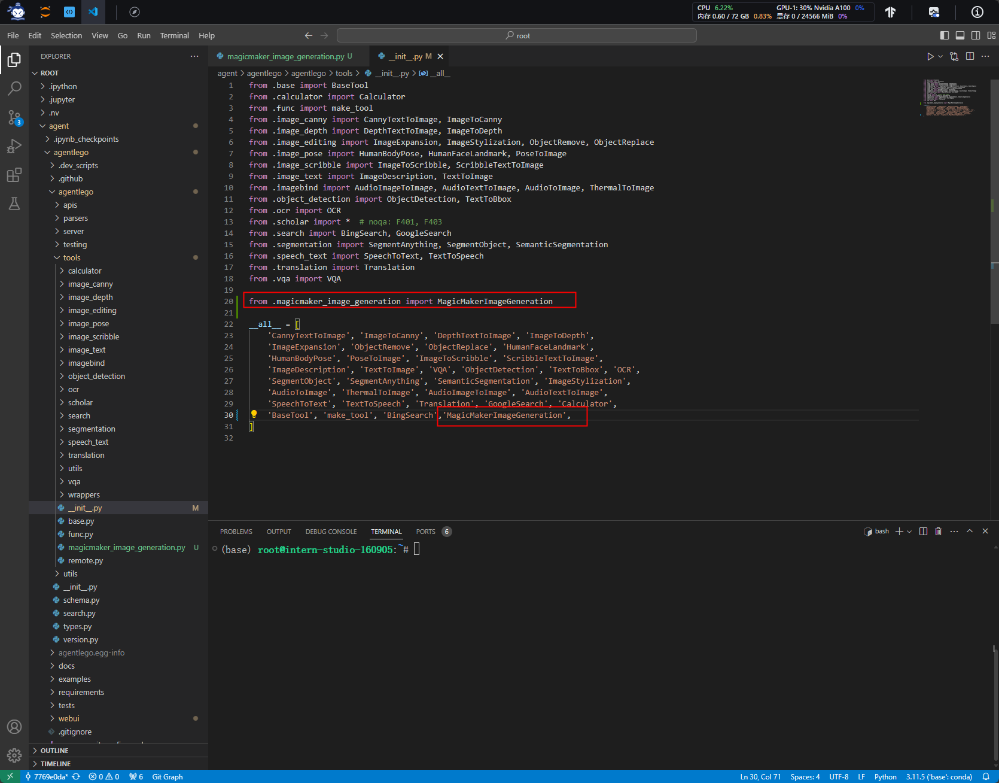

```python linenums="1"
from .base import BaseTool
from .calculator import Calculator
from .func import make_tool
from .image_canny import CannyTextToImage, ImageToCanny
from .image_depth import DepthTextToImage, ImageToDepth
from .image_editing import ImageExpansion, ImageStylization, ObjectRemove, ObjectReplace
from .image_pose import HumanBodyPose, HumanFaceLandmark, PoseToImage
from .image_scribble import ImageToScribble, ScribbleTextToImage
from .image_text import ImageDescription, TextToImage
from .imagebind import AudioImageToImage, AudioTextToImage, AudioToImage, ThermalToImage
from .object_detection import ObjectDetection, TextToBbox
from .ocr import OCR
from .scholar import *  # noqa: F401, F403
from .search import BingSearch, GoogleSearch
from .segmentation import SegmentAnything, SegmentObject, SemanticSegmentation
from .speech_text import SpeechToText, TextToSpeech
from .translation import Translation
from .vqa import VQA

from .magicmaker_image_generation import MagicMakerImageGeneration

__all__ = [
    'CannyTextToImage', 'ImageToCanny', 'DepthTextToImage', 'ImageToDepth',
    'ImageExpansion', 'ObjectRemove', 'ObjectReplace', 'HumanFaceLandmark',
    'HumanBodyPose', 'PoseToImage', 'ImageToScribble', 'ScribbleTextToImage',
    'ImageDescription', 'TextToImage', 'VQA', 'ObjectDetection', 'TextToBbox', 'OCR',
    'SegmentObject', 'SegmentAnything', 'SemanticSegmentation', 'ImageStylization',
    'AudioToImage', 'ThermalToImage', 'AudioImageToImage', 'AudioTextToImage',
    'SpeechToText', 'TextToSpeech', 'Translation', 'GoogleSearch', 'Calculator',
    'BaseTool', 'make_tool', 'BingSearch','MagicMakerImageGeneration',
]
```
#### 2.5.3 启动自定义工具

在两个 terminal 中分别启动 LMDeploy 服务和 AgentLego 的 WebUI 以体验我们自定义的工具的效果。

- 启动 LMDeploy 服务

```bash
conda activate agent
lmdeploy serve api_server /root/share/new_models/Shanghai_AI_Laboratory/internlm2-chat-7b \
                            --server-name 127.0.0.1 \
                            --model-name internlm2-chat-7b \
                            --cache-max-entry-count 0.1
```

- 启动 AgentLego 服务

```bash
conda activate agent
cd /root/agent/agentlego/webui
python one_click.py
```
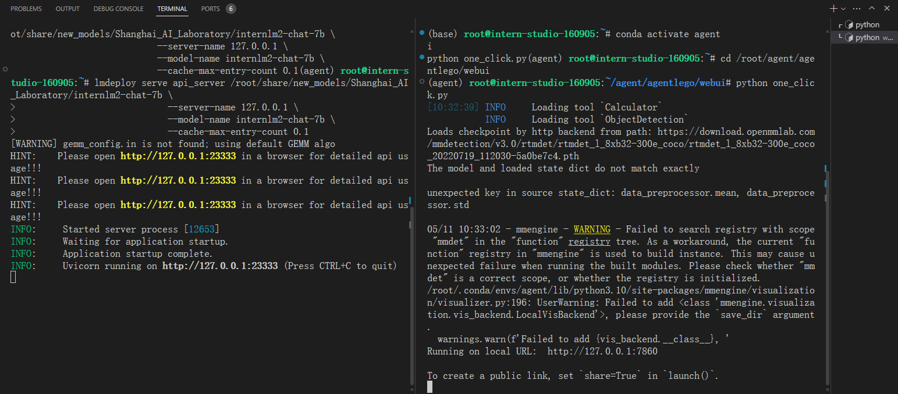

- 本地连接

```bash
ssh -CNg -L 7860:127.0.0.1:7860 -L 23333:127.0.0.1:23333 root@ssh.intern-ai.org.cn -p 48061 
```

- 设置Tools

Tool class 选择MagicMakerImageGeneration并点击save

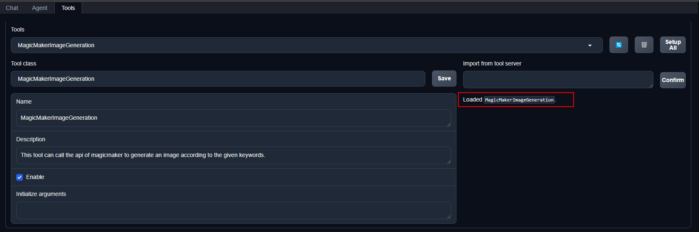

#### 2.5.4 应用结果

- 选择自定义tools

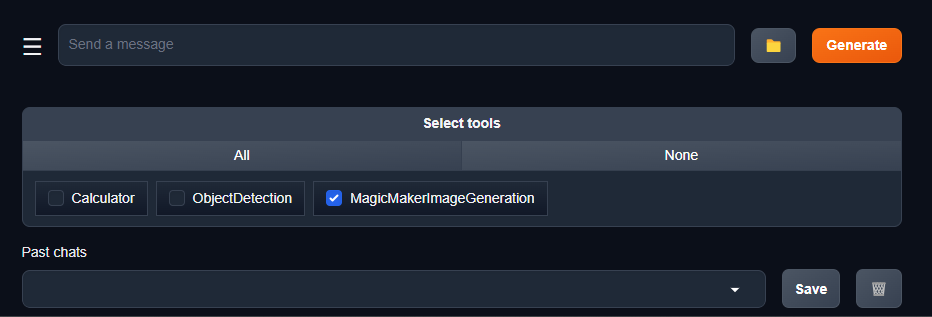

- 输入文字要求

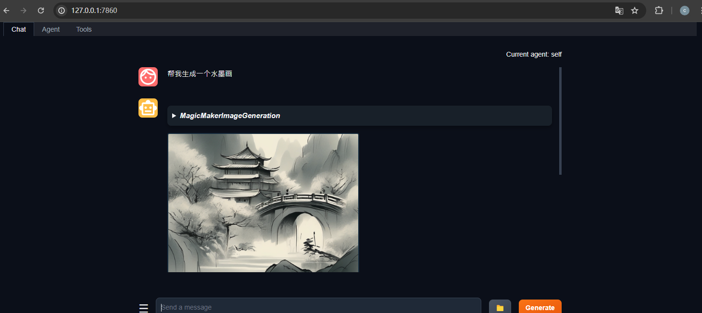


